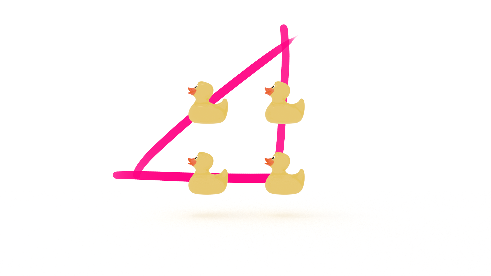

@TODO introduction

_This article originally published in my newsletter, [The Solution](https://mailchi.mp/f21680161849/the-solution-how-do-you-embrace-difficulty)_

I thought I wanted to be an artist. 

It’s a difficult career path.

But I was all in. 

I went to graduate school and earned an MFA.

I got hired as the assistant to the artist Thomas Houseago. 

Hosueago was the next big thing.

Everybody wanted to be his assistant. 

Since I filled that role, they wanted to be my friend. 

It was prestigious and glamorous. 

And then I got fired. 

My new friends abandoned me. 

I didn’t do anything wrong, but that didn’t stop me from feeling like a failure.

I qualified for unemployment and received a bi-weekly check that was enough to cover rent.

I hustled for side gigs and freelance work to cover the rest while I looked for full-time employment. 

It was the Great Recession. 

There weren’t any jobs.

And you can only look for work for so many hours a day before there’s nothing else to see.

So I spent the rest of my time learning.

I taught myself C++ and openFrameworks.

And microcontrollers. 

And 3D modeling. 

I wasn’t worried about being productive.

I was pursuing what I thought was interesting and fun.

And then I landed a great gig as an exhibit technician at the Natural History Museum in Los Angeles. 

Why did they hire me? 

Because I knew openFrameworks, microcontrollers, and 3D modeling. 

I fell into it.

It was awesome. 

I spent my days tinkering, designing and building interactive exhibits, working with smart, interesting people.

It didn’t feel like work. 

The experience I gained there paved the way for my next gig with the National Science Foundation. 

And that paved the way for where I am today.

Do I miss the art world? 

I rarely think about it.

I like what I do.

Why am I telling you this tale? 

It was difficult getting fired. 

Making ends meet was hard. 

In retrospect, that time period established my career path. 

The future is unknown.

Things will change.

Prepare yourself for that day.

In [A Mind for Numbers](https://amzn.to/2UWpClG), Barbara Oakley writes: 

> Taking responsibility for your own learning is one of the most important things you can do. 

Persistence is key. 

“Persistence is often more important than intelligence. Approaching material with a goal of learning it on your own gives you a unique path to mastery.”

But Barbara, sometimes learning is difficult! 

This is a good thing. 

The authors of [Make It Stick](https://amzn.to/2QTzklN), counsel us to embrace difficulty: 

> Difficulty in learning new things is not only to be expected but can be beneficial. 

How do you persist in persistence? 

Habits.

🙄

Yes, I’m making a habit of habits. 

In [Atomic Habits](https://amzn.to/2NZz8jx), James Clear defines “The Goldilocks Rules”, which states that:

> ...humans experience peak motivation when working on tasks that are right on the edge of their current abilities. Not too hard. Not too easy. Just right.

We need to be challenged, not only to learn, but to build the habit of learning. 

According to Brown, Roediger, and McDaniel, learning is at least a three-step process:

1. **Encoding**: information is held in short-term working memory before being consolidated into a cohesive representation of knowledge in long-term memory.

2. **Consolidation**: reorganizes and stabilizes memory traces, gives them meaning, and makes connections to past experiences and to tohter knowledge already stored in long-term memory.

3. **Retrieval**: updates learning and enables you to apply it when you need it.

They write that, “retrieval practice that’s easy does little to strengthen learning; the more difficult the practice, the greater the benefit.”

If the problem is too easy, we’ll get bored. 

“The greatest threat to success is not failure but boredom. We get bored with habits because they stop delighting us.” James Clear continues: 

> The only way to become excellent is to be endlessly fascinated by doing the same thing over and over. You have to fall in love with boredom.

What if the problem is too difficult? 

In [The Pragmatic Programmer](https://amzn.to/30BVrAW), authors Andy Hunt and Dave Thomas offer several strategies for solving impossible problems, the first being:

> Don’t think outside the box--_find_ the box!

We often dismiss potential solutions too readily due to our preconceived notions. They write that, “the secret is to identify the real (not imagined) constraints, and find a solution therein.” 

Can you connect all of the ducks and return to the starting point with just three straight, connected lines? 

How would you solve this problem? 

(The solution is above.)

Sometimes you need to just get out of your own way!

Take a break.

Do something fun.

Let your diffuse mode work on the problem. 

If that doesn’t work, ask for help. 

Ask someone to ask you the following questions:

* Why are you solving this problem? 

* What’s the benefit of solving it?

* Are the problems you’re having related to edge cases? 

* Is there a simpler, related problem you can solve?

If there’s no one around, talk to the duck.

Lastly, Hunt and Thomas remind us that, “Fortune favors the prepared mind”: 

> In order to have eureka! moments, your nonconscious brain needs to have plenty of raw material; prior experiences that can contribute to an answer. 

