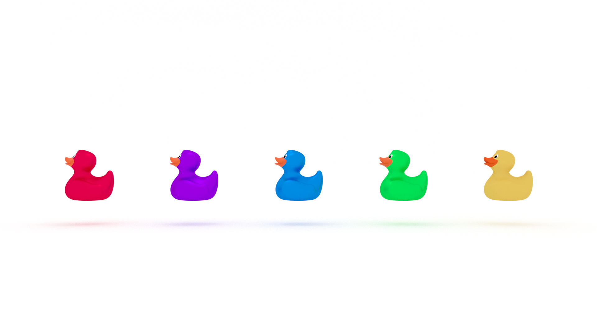

Emotion is an important, and often overlooked, factor for success in both problem solving and learning. We can use empathy to spark creativity. But, sometimes emotion blocks our creativity. This article outlines common emotional blocks with advice for unblocking our creativity.

_This article originally published in my newsletter, [The Solution](https://mailchi.mp/56497a1c27df/the-solution-how-are-you-feeling)._

## Emotion & Metacognition

What is the role of emotion in metacognition? 

Emotion is an important, and often overlooked, contributing factor to success in both problem solving and learning. 

In [How Humans Learn](https://amzn.to/3cmDuvR), Joshua R. Eyler writes:

> Emotions are inextricably a part of our actions, our behavior, our psychology, and our mechanisms for learning because they are connected to the development or function of so many other networks in our brains. 

Is emotion responsible for our development as a problem-solving species?

> Problems, especially those that have to do with our interactions with other people, activate an emotional response that can help us to potentially find a resolution. Our emotions drive us to work together toward a common goal, to learn from one another, and to make important decisions about our safety or the well-being of others. 

What role does emotion play in our day-to-day problem solving?

Empathy.

## Empathy & Creativity

“The key to empathizing is learning to perceive the world through someone else’s mind and body,” write Robert and Michel Root-Bernstein in [Sparks of Genius](https://amzn.to/2UhVpgo). They continue: 

> We have found that practitioners of every art, science, and humanistic profession use empathy as a primary tool, for it permits a kind of understanding that is not attainable by any other means. 

What does this mean in practice? 

How do we learn to empathize? 

Furthermore, how do we learn to empathize when what we are working with is not human? 

The answer is Shakespearean: play-acting. 

According to the Root-Bernstein's, Richard Feynman “revolutionized quantum physics by asking himself questions such as ‘If I were an electron, what would I do?’”

The authors of Sparks of Genius recount tales of programmers and engineers who “walk around inside their microchips and programs somewhat like the characters who are sucked into the world of electronic circuits in the movie Tron.” 

In [Alien Phenomenology](https://amzn.to/2xEIyMo), Ian Bogost implores us to explore this further:

> As operators or engineers, we may be able to describe how such objects and assemblages work. But what do they experience? What’s their proper phenomenology? In short, what is it like to be a thing?

While empathy is a powerful tool, sometimes our emotions block us from learning and solving problems. 

## Emotional Blocks

In [Conceptual Blockbusting](https://amzn.to/2Io9QrZ), James L. Adams identifies six types of emotional blocks:

* Fear of making a mistake, failing, or taking a risk

* Inability to tolerate ambiguity, an overriding desire for security and order, no appetite for chaos

* Preference for judging ideas rather than generating them

* Inability to relax, incubate, and sleep on it

* Lack of challenge (problem fails to engage interest) or excessive zeal (over-motivation to succeed quickly)

* Inability to distinguish reality from fantasy

Let's take a closer look at each of these.

### Fear of Taking a Risk

We are all too familiar with this first block. It’s what prevents us from starting a new project, from applying for a new job, from making that pitch. Adams sums up this experience nicely: 

> The expression of a new idea, and especially the process of trying to convince someone else that it has value, sometimes makes you feel like an a**, since you are doing something that possibly exposes your imperfections. 

How do we unblock our fear of failure? 

We can "realistically assess the possible negative consequences of an idea."

What is the worst that can happen?

Are your fears founded or unfounded?

"What are your catastrophic expectations?"

### No Appetite For Chaos

This may be the emotional block most relevant to software development. Adams succinctly describes the process of debugging:

> The solution of a complex problem is a messy process. Rigorous and logical techniques are often necessary but not sufficient. You must usually wallow in misleading and ill-fitting data, hazy and difficult-to-test concepts, opinions, values, and other such untidy quantities. In a sense, problem-solving is bringing order to chaos. A desire for order is therefore necessary. However, the ability to tolerate chaos is a must.

### Judging Rather Than Generating New Ideas

Many of these emotional blocks are intertwined. If you don’t have an appetite for chaos, you may also be quick to judge. We reject ideas if we analyze or judge too quickly. According to Adams, this is detrimental for two reasons: 

1. Newly formed ideas are fragile and imperfect--they need time to mature and acquire the detail needed to make them believable. 

2. Ideas often lead to other ideas. 

### Inability or Unwillingness to Incubate

Relaxing judgment is important, but so is just relaxing in general. We know that in order to cultivate eureka! moments, we need to let our diffuse mode work on the problem. According to Adams, there are other benefits gained from taking a break:

> Your overall compulsiveness is less fanatical when you are relaxed, and the brain is more likely to deal with seemingly silly combinations of thoughts. If you are never relaxed, your brain is usually on guard against non-serious activities, with resulting difficulties in the type of thinking necessary for fluent and flexible conceptualization.

### Lack of Challenge vs. Excessive Zeal

We need to maintain motivation to solve a problem or learn a new skill, but we need to allow the process to unfold as it will. We "cannot do our best on a challenge unless we are motivated. On the other hand, excessive motivation to succeed, especially to succeed quickly, can inhibit the creative process.”

### Reality and Fantasy

We need to give ourselves permission to fantasize. “The imagination is extremely powerful because it can go beyond reality. But in order to do this, the imagination must be set free of the constraints placed upon real acts and events.”

## Emotion in Learning & Problem Solving

I'll leave you with one more piece of advice from Adams for effective problem solving with emotion:

> We are more likely to be creative and in a state of flow if we love the things we are doing. 

❤️