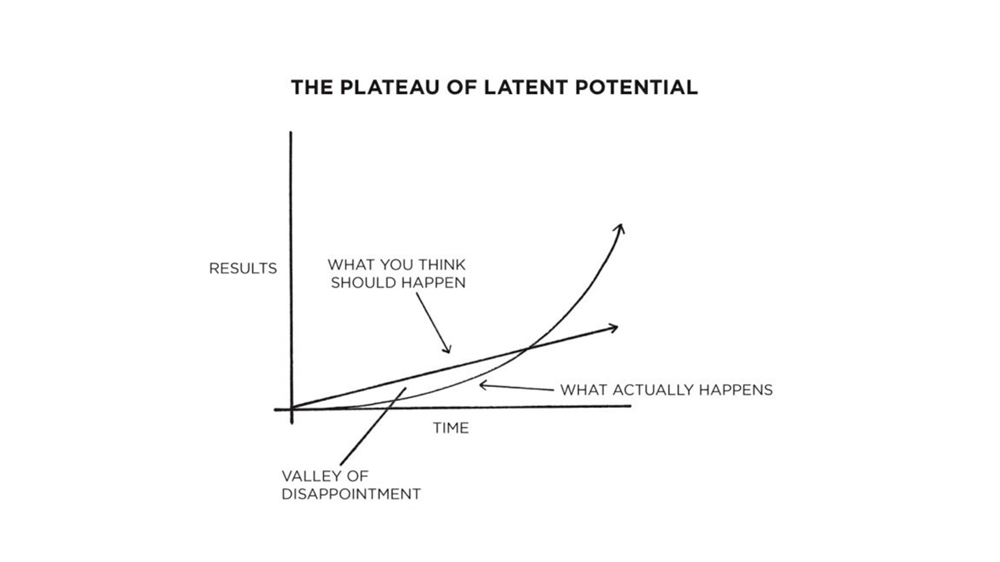

Expertise is a journey, not a destination. 

There are three simple steps we can take to become an expert in any domain: 

* Assume a growth mindset 

* Apply deliberate practice 

* Play to your strengths 

## How to Be an Expert

Quadratic growth is terrible.

For algorithms.

But it’s desirable when it comes to our personal growth. 

In _Atomic Habits_, James Clear describes the phenomenon he calls “The Plateau of Latent Potential”. This is the time period in which you are learning a new skill or working on a project and it feels like you are not making progress. You think you should be progressing linearly, but what you don’t realize is that you are progressing quadratically, maybe even exponentially. 

The outset is a slog.

Configuration, installations, definitions, conventions, nomenclature, syntax, tooling… 

It’s grueling!

There’s a critical threshold to cross before growth accelerates. And then… lookout! 

The sky is the limit!

But first you must cross "The Valley of Disappointment". 

It’s a treacherous place for developers. 🐇 The terrain of our field is constantly shifting and everyone is opinionated. 

Who do you trust?

You can see the other side of The Valley, but not the path to get there. 

It’s easy to lose your way.

There’s no map.

So you Google it.

And you open so many browser tabs you can no longer read their titles. 

You find yourself in tutorial purgatory.

Or deciphering the comments on StackOverflow. 

Or worse yet, on the second page of search results! 

😱

How do you solve this problem? 

🐰 Habits. 

If you want to learn a new skill, such as programming, or improve your problem solving, you must make it a habit. 

Yeah, yeah. You heard me the first time. TODO

But really, how do you solve this problem?

Talk to the duck.

🦆

Understanding the problem or challenge, framing it clearly and articulately, is the first, and most important step to becoming an expert. It also defines the boundaries of what you are learning or solving in order to prevent scope creep. 

Focus on one thing at a time. If you chase two rabbits, both are going to get away.

Read The Fantastic Manual! Always refer to primary sources and start with the official tutorials. If you’re following a third-party tutorial, make sure it’s recent. Technical tutorials have a short shelf life. (There’s a caveat, though: sometimes the docs are outdated or non-existent and this is an opportunity to contribute to a project!)

Make it a habit. 

Don’t give up.

But do take breaks. 

As with Archimedes in the bathtub, sometimes you need to pull off the highway to see Eureka.

## Assume a Growth Mindset  

To gain expertise, we need to first assume a _growth mindset_. In [Mindset](https://amzn.to/2E4SL5E), Carol Dweck outlines two different learner mindsets:

* fixed

* growth

Individuals with a fixed mindset view intelligence as static, an innate, unchanging quality, whereas individuals with a growth mindset view intelligence as a quality that can be developed and changed over time.

In [Make It Stick](https://amzn.to/2QTzklN), Brown et al map fixed and growth mindsets to two types of goals:

* Performance 

* Ability

According to the authors:

> People with performance goals unconsciously limit their potential. If your focus is on validating or showing off your ability, you pick challenges you are confident you can meet. You want to look smart, so you do the same stunt over and over again. But if your goal is to increase your ability, you pick ever-increasing challenges, and you interpret setbacks as useful information that helps you to sharpen your focus, get more creative, and work harder. 

Lucky for us, our brains are plastic. Even if our mindset is fixed, we can recode it for growth.

In [A Mind for Numbers](https://amzn.to/2UWpClG), Barbara Oakley writes:

> It seems people can enhance the development of their neuronal circuits by practicing thoughts that use those neurons. We’re still in the infancy of understanding neural development, but one thing is becoming clear--we can make significant changes in our brain by changing how we think.

How do we gain expertise? 

## Practice Makes Practice

We gain expertise through deliberate practice. 

The authors of [Make It Stick](https://amzn.to/2QTzklN) explain that deliberate practice is “goal directed, often solitary, and consists of repeated striving to reach beyond your current level of performance.” They continue:

> Whatever the field, expert performance is thought to be garnered through the slow acquisition of a larger number of increasingly complex patterns, patterns that are used to store knowledge about which actions to take in a vast vocabulary of different situations. 

These patterns are mental models. Building mental models requires effortful learning, but that effort builds new connections and capabilities. It changes the brain and makes us expert.

In [Atomic Habits](https://amzn.to/2NZz8jx), James Clear makes a compelling argument for deliberate practice: 

“...if you can get 1 percent better each day for one year, you’ll end up thirty-seven times better by the time you’re done. Conversely, if you get 1 percent worse each day for one year, you’ll decline nearly down to zero.”

Clear did the math for us:

|   1% + / -                        | Result        |
| ---                               | ---           |
| 1% worse every day for one year | 0.99365 = 00.03 |
| 1% better every day for one year | 1.01365 = 37.78 |

It's clear (sorry) that we need to continually practice to not only improve, but maintain a baseline of expertise. 

## Play To Your Strengths

What if we aren’t born with “a mind for numbers”? 

The authors of [Make It Stick](https://amzn.to/2QTzklN) write:

> Expert performance is a product of the quantity and the quality of practice, not of genetic predisposition, and that becoming expert is not beyond the reach of normally gifted people who have the motivation, time, and discipline to pursue it. 

In addition to building mental models, we can also play to our strengths. We can specialize.

In [Atomic Habits](https://amzn.to/2NZz8jx), James Clear encourages us to find a ‘game’ where the odds are in our favor. We can do so by asking ourselves the following questions:

* What feels like fun to me, but work to others?

* What makes me lose track of time? 

* Where do I get greater returns than the average person? 

* What comes naturally to me? 

The answers to these questions will lead you to your area of specialization.

According to Clear:

> Once we realize our strengths, we know where to spend our time and energy. We know which types of opportunities to look for and which types of challenges to avoid. The better we understand our nature, the better our strategy can be.

Deliberate practice and specialization make sense if you’re an athlete or a musician. But what about programmers? Technology changes too rapidly! 

That’s a good thing. Especially if you have a growth mindset. It means there’s always an opportunity to “reinvent” yourself. If you are pragmatic, you’re already on it. David Thomas and Andy Hunt outline several guidelines for acquiring "intellectual capital" in [The Pragmatic Programmer](https://amzn.to/30BVrAW): 

* Learn at least one new language every year

* Read a technical book each month

* Read nontechnical books, too

* Take classes

* Participate in local user groups and meetings

* Experiment with different environments

* Stay current

Hunt and Thomas additionally counsel us to “think _critically_ about what [we] read and hear”. There’s a lot of hype and vested interests in technology and it’s important to focus our efforts on the _right_ things. 

We can do that by building _mental models_. Hunt and Thomas provide a few questions we can ask ourselves to improve our critical thinking ability: 

* Ask the “Five Whys”

* Who does this benefit? 

* What’s the context? 

* When or Where would this work? 

* Why is this a problem? 

 
## A Guide for TODO 

Do you want to be an expert? 

The authors of [Make It Stick](https://amzn.to/2QTzklN) offer advice on achieving that goal:

> It comes down to the simple fact that the path to complex mastery or expert performance does not necessarily start from exceptional genes, but it most certainly entails self-discipline,  grit, and persistence; with these qualities in healthy measure, if you want to become an expert, you probably can. 

To _self-discipline_, _grit_, and _persistence_, let's add **metacogntion**. 

Programming, problem solving, and learning are metacognitive activities. We want to improve our thinking about thinking.

In [Conceptual Blockbusting](https://amzn.to/2Io9QrZ), James L. Adams writes:

> For all our education and training as thinkers, we acquire knowledge, perhaps skill, and maybe appreciation, but we could go much further if we just spent more time thinking about the process of thinking. 

Expertise is a journey, not a destination. To become an expert, we need to first decide that it's possible by assuming a growth mindset and then commit to deliberate practice that plays to our strengths. 