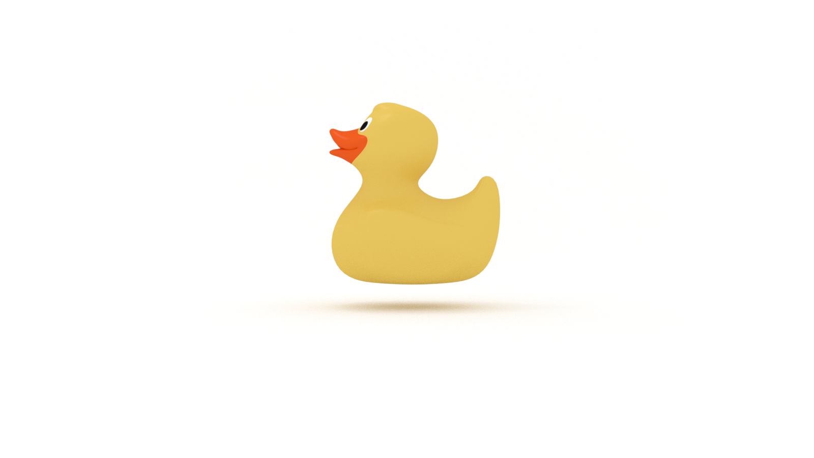

When was the last time programming was fun? 

Perhaps you were building or debugging an app or designing an API or UI and suddenly you felt hungry and realized, hours later, that it was time for lunch or dinner.

You were in the zone! 

But flow is fleeting! 

Being in the zone feels easy. 

Staying in the zone is hard work. 

When was the last time programming was boring? 

Or induced anxiety? 

In those scenarios, the problem was either too easy or to difficult. 

How do we reliably and consistently get in the zone? 

To get in the zone, or find flow, requires us to first learn the prerequisite skills. We need to continually invest in our knowledge portfolios over time. Otherwise, we will get bored or feel anxious when working on a problem. 

## What is Flow?

In [the book of the same title](https://amzn.to/35NmVb3) Mihaly Csikszentmihalyi defines _flow_ as “... the state in which people are so involved in an activity that nothing else seems to matter.” He continues:

> ‘Flow’ is the way people describe their state of mind when consciousness is harmoniously ordered, and they want to pursue whatever they are doing for its own sake.

Programmers often refer to this phenomenon as being 'in The Zone'. We can also describe this as _optimal experience_. According to Csikszentmihalyi: 

> The best moments usually occur when a persons’ body or mind is stretched to its limits in a voluntary effort to accomplish something difficult and worthwhile. Optimal experience is thus something we can make happen.”

## What Problem Does Flow Solve?

We can use the optimal experience of a flow state to manage our most precious resource: attention. According to Csikszentmihalyi: 

> Attention is like energy in that without it no work can be done, and in doing work it is dissipated. We create ourselves by how we invest this energy.

We use our attention, or psychic energy, to Get Things Done (GTD). More than that, and perhaps more importantly, flow can help us find happiness. 

> ...in the long run, optimal experiences add up to a sense of mastery--or perhaps better, a sense of participation in determining the content of life--that comes as close to what is usually meant by happiness as anything else we can conceivably imagine.

## How Do We Find Flow? 

In [Flow](https://amzn.to/35NmVb3), Mihaly Csikszentmihalyi outlines the **The Elements of Enjoyment**, or, the conditions required to achieve flow: 

1. **A Challenging Activity that Requires Skill**

There's a balance to strike between boredom and anxiety. If the activity is too easy, we will feel bored. If the activity is too difficult, we will feel anxious. We need to be engaged in a task that pushes us just beyond our limits. Lastly, we need to know _how_ to solve the problem at hand. According to Csikszentmihalyi: 

> ...the overwhelming proportion of optimal experiences are reported to occur within sequences of activities that are goal-directed and bounded by rules--activities that require the investment of psychic energy, and that could not be done without the appropriate skills.

2. **The Merging of Action and Awareness**

This is where we 'get in The Zone', becoming wholly immersed in the task at hand. According to Csikszentmihalyi: 

> When all a person’s relevant skills are needed to cope with the challenges of a situation, that person’s attention is completely absorbed by the activity. As a result, one of the most universal and distinctive features of optimal experience takes place: people become so involved in what they are doing that the activity becomes spontaneous, almost automatic; they stop being aware of themselves as separate from the actions they are performing.

3. **Clear Goals**

We also need a clear idea of the problem we are solving (or creating, for that matter), because, again, with no goal, we will feel either bored or anxious, unless we are Zen masters. According to Csikszentmihalyi, “the reason it is possible to achieve such complete involvement in a flow experience is that goals are usually clear, and feedback immediate.”

Which leads us to the next condition...

4. **Feedback**

As stated above, immediate feedback is an essential element of enjoyment as it informs, and enables us to continue, our actions. According to Csikszentmihalyi: 

> The kind of feedback we work toward is in and of itself often unimportant... What makes this information valuable is the symbolic message it contains: that I have succeeded in my goal.

We need something or someone to let us know we are on (or off) track. 

5. **Concentration on the Task at Hand**

We don't get distracted in _flow_ because “...the clearly structured demands of the activity impose order, and exclude the interference of disorder in consciousness.”

6. **The Paradox of Control**

According to Csikszentmihalyi, “...the flow experience is typically described as having a sense of control--or, more precisely, as lacking the sense of worry about losing control that is typical in many situations in normal life.” 

This sounds extreme, but keep in mind that Csikszentmihalyi is a psychologist and is using clinical jargon. In "normal life", there are external factors beyond our control which disrupt and/or prevent flow. 

There's a paradox to control, though. Flow activities can become addictive:

> When a person becomes so dependent on the ability to control an enjoyable activity that he cannot pay attention to anything else, then he loses the ultimate control: the freedom to determine the content of consciousness.

Keep the flows in check!

7. **The Loss of Self-Consciousness**

In a flow state, we don't think about ourselves performing the activity, we just do it. According to Csikszentmihalyi, “...in flow there is no room for self-scrutiny."

8. **The Transformation of Time**

Did you ever get so immersed in an activity that you lost track of time? That's _flow_. According to Csikszentmihalyi, “...time no longer seems to pass the way it ordinarily does. The objective, external duration we measure with reference to outside events like night and day, or the orderly progression of clocks, is rendered irrelevant by the rhythms dictated by the activity.”

## How does flow relate to programming?

In [Code Complete](https://amzn.to/2JCCarc), Steve McConnell states that Software’s Primary Technical Imperative is to _Conquer Complexity_.  

> Although it’s tempting to try to be a hero and deal with computer-science problems at all levels, no one’s brain is really capable of spanning nine orders of magnitude of detail. Computer science and software engineering have developed many intellectual tools for handling such complexity…

McConnell provides a few examples of these intellectual tools:

> When you put a complicated test into a boolean function and abstract the purpose of the test, you make the code less complex. When you substitute a table lookup for a complicated chain of logic, you do the same thing. When you create a well-defined, consistent class interface, you eliminate the need to worry about implementation details of the class and you simplify your job overall.

Like flow, we want to bring order to chaos, or conquer complexity, long enough for us to GTD. We can do that by using coding conventiosn to clear a path to our goal by eliminating decision fatigue. According to McConnel, “...conventions are the most useful when they spare you the trouble of making and defending arbitrary decisions.” He continues:

> The point of having coding conventions is… mainly to reduce complexity. When you can standardize decisions about formatting, loops, variable names, modeling notations, and so on, you release mental resources that you need to focus on more challenging aspects of the programming problem.”

## Flow Requires Friction

In order to GTD, we need to first learn the skills to accomplish our goals. And that requires the opposite of flow: _friction_. Learning to program requires _a lot_ of friction because, well, formal languages aren't _natural_. Formal langagues require more effort. Barbara Oakley offers a theory for this situation in [A Mind for Numbers](https://amzn.to/2UWpClG):

> This may be because humans haven’t evolved over the millennia to manipulate mathematical ideas, which are frequently more abstractly encrypted than those of conventional language. Obviously, we can still think _about_ math and science--it’s just that the _abstractness_ and _encryptedness_ adds a level--sometimes a number of levels--of complexity. 

Friction is required to _make it stick_. According to the authors of [Make It Stick](https://amzn.to/2QTzklN): 

> The more effort that is required to recall a memory or to execute a skill, provided that the effort succeeds, the more the act of recalling or executing benefits the learning. 

Sustaining effort and focus while learning a formal language is challenging. Barbara Oakley counsels us to focus on the _process_ and not the _product_:

> By focusing on _process_ rather than _product_, you allow yourself to back away from judging yourself and allow yourself to relax into the flow of the work.

Ah! So we _can_ find flow in friction!

## How to Get in the Zone

To get in the zone, or find flow, requires us to first acquire the necessary skills. In learning those skills, we will encounter friction, which is a good thing. To stay in the zone over time, we need to continually invest our knowledge portfolios or we will become bored or anxious. 

Practice makes practice. 

