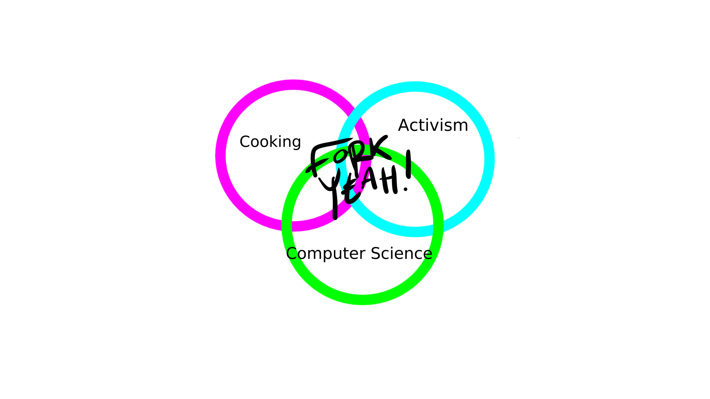

> ESTRAGON: I can't go on like this.
>
> VLADIMIR: That's what you think.
>
> ― Samuel Beckett, Waiting for Godot

Are things as bad as they seem right now?

Breaking news is breaking my spirit.

Walls.

Bans.

Anger.

Fear.

Death.

But.

We can’t let politics distract us from the elephant in the room.

Life.

We must go on.

And so too our progeny.

2016 was the warmest year on record. 2019 was the second, following a sequence of record breaking annual temperatures.

It’s about to get hot AF.

I don’t know about you, but I like this planet. I don’t want to live on Mars. Moving across town is stressful enough.

So what do we do?

We get healthy.

Whether you plan to join the anarchists or run for office, you need a sharp mind and a strong body.

I don’t know how we’re going to un-fuck ourselves. I don’t have solutions to far-right populism or global warming.

I do know that we gotta eat.

And we can thrive on plants alone.

Livestock production is responsible for more greenhouse gas emissions than all forms of transportation combined.  

That’s right.

Planes, trains and automobiles are less bad than adorable burping poop-machines.

Numerous studies show that switching to a plant-based diet, or even eating within the recommended guidelines for meat consumption, will significantly reduce food-related greenhouse gas emissions.

And by significant, I’m talking 70% reduction for veganism.

That’s huge.

You know what else is huge?

The amount of water meat production sucks up. It takes approximately 4 million gallons of water to produce one ton of beef. One ton of vegetables, on the other hand, only requires somewhere between 50,000-100,000 gallons per ton, depending on the crop.

Maths.

Do them.

Unless you’ve been eating too much meat.

It’s our world.

If you don’t like where it’s going, fork it!

Start with food.

Feed that head.

The future needs smart cookies.

Gluten-free, sugar-free cookies with stamina and focus.

What does the future look like to you?

How are you eating your way there?

## What is Fork Yeah!?

Fork Yeah! merges cooking, computer science and activism. If you’re not interested in any of those, you’re in the wrong place. Beat it.

* Fork Yeah! recipes are gluten-free, sugar-free, soy-free and vegan.
* Fork Yeah! recipes are curated to optimize energy stability and boost brain function so you can spend your precious time feeling alert and alive. No more peaks and valleys. No more crash and burn.
* Fork Yeah! recipes are structured for speed and ease of preparation. The directions are written to maximize efficiency and readability without ambiguity.
* Fork Yeah! recipes constitute a functional ecosystem so you won’t have a cupboard full of random ingredients. Collectively, they are organized for maximum return-on-investment.
* Fork Yeah! will teach you how to make a recipe your own and make it better, or, fork it.  
* Fork Yeah! dives into the science of cooking so you can make it an art.

Fork Yeah! will make you smart AF (As Fork).

The idea is to learn to cook, not follow recipes.

Clone the book to your head.

## What is Git?
Cooking is an art and a science. It’s a fundamental skill. It’s not hard. You don’t have to be a rockstar. You just need to know the basics.

Coding is an art and a science. In the 21st century, it’s a fundamental skill. It’s also not hard. You don’t have to be a rockstar. You just need to know the basics.

Git is a version control system. It is most commonly used to develop software.

Say you’re writing a program and you want to test a new feature. You could copy all of your files to a new folder, code the feature, test it, and if you like the result, copy/paste the changes back into the original files.

Or you could use Git.

Git tracks changes in files, allowing you to try new things easily and efficiently without commitment. Doing this is called branching. If you like what you see on the branch, you commit and merge the changes back to the trunk of the tree, or the master.

If you want to modify, improve, or pervert someone else’s project, you fork it, and make it your own.

## What is GitHub?
GitHub is a web-based version of Git. You can store your files and projects in repositories, or repos. You can browse the projects of other developers and fork or clone them, which means to download it to your computer.

Fork Yeah! uses Github to host its recipes and its website.

## Do You Need to Learn to Code or Use Git?

You don’t have to use Git or learn to code to get the most out of Fork Yeah!

But you’re dually badass if you do.

If you want to learn how to use Git and GitHub, start [here](https://guides.github.com/activities/hello-world/).

If you want to get smart, [sign up for the newsletter](http://eepurl.com/cDweO5).

Go Fork.

Do great things.
