Software developers use GitHub repositories to host the code for their projects. We can create a GitHub repository for any purpose, like recipes! GitHub? More like GutHub? 

## Create a GitHub Repository and Your First Commit

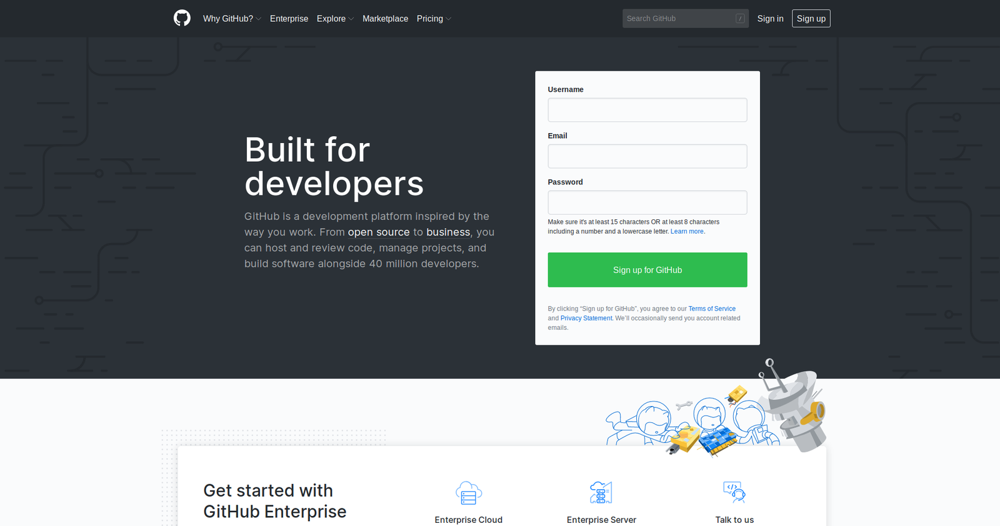

If you don't have one already, navigate to [GitHub](https://github.com) and create an account.

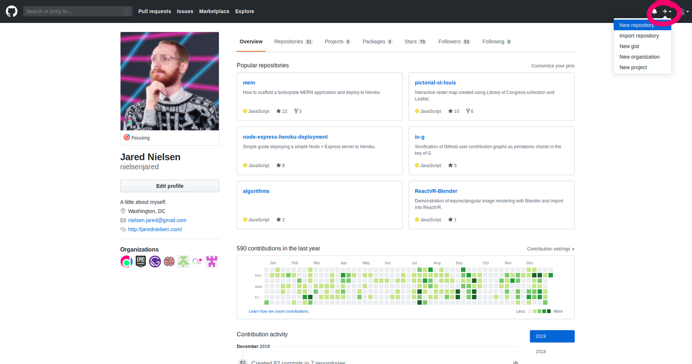

The primary purpose of GitHub is to create and host repositories. What's a repository? We can think of a repository like a cookbook or a recipe box: it's a place for us to store our recipes. 

GitHub provides several different options for creating a new repository. The easiest to access is in the right side of the navbar. If you click the `+` sign, the first option in the dropdown menu is `New repository`. 

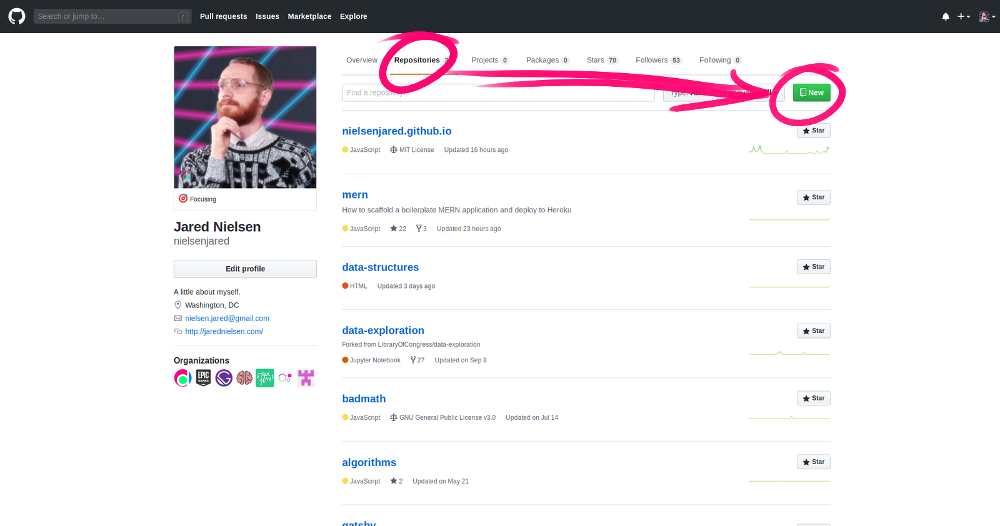

Alternatively, if we navigate to our `Repositories` tab, we are presented with a green button that reads, `New`. 

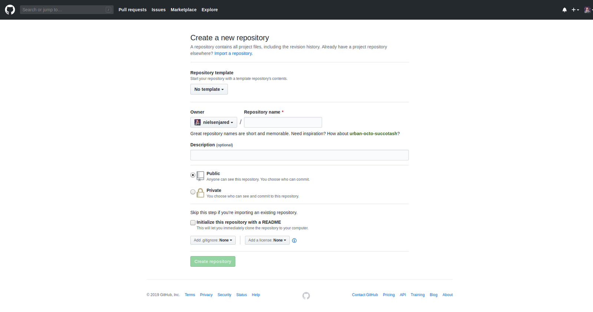

However you decide to create a repository, you will be routed to a page that allows you to fill in details about your project. The only thing that is required (`*`) at this point is a name. 

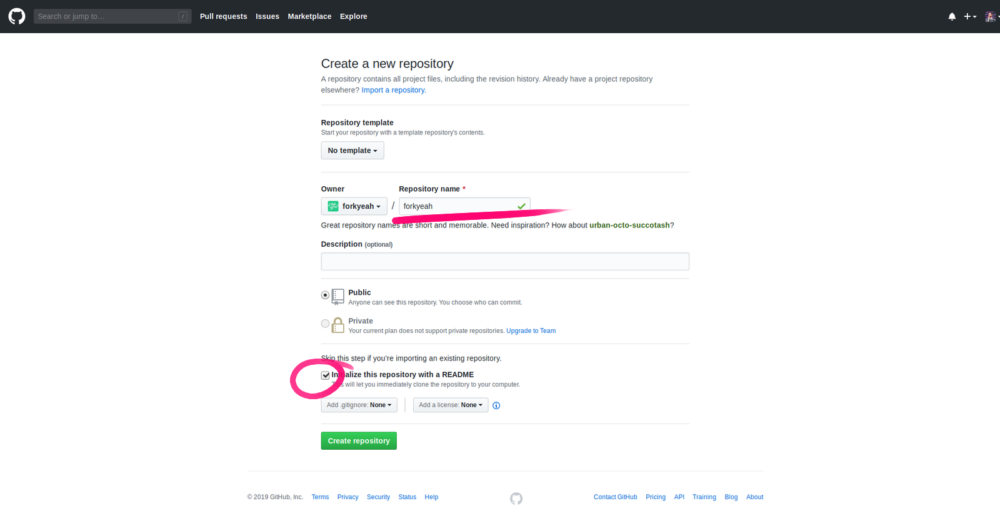

This will be the Fork Yeah! repository, so I name it `forkyeah`. You will notice two things: 

1. I changed the owner from my account, `nielsenjared`, to `forkyeah`, which is an organization.

2. I selected the checkbox next to `Initialize this respository with a README`. 

What's a README? A README file is just that, a file that you should read. All good software projects include a README file to quickly get other developers oriented and up-to-speed.

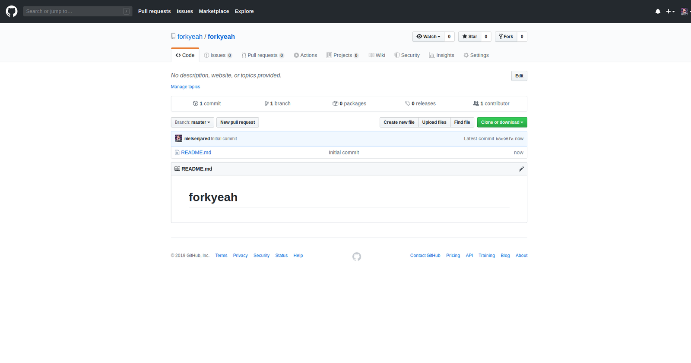

After clicking the green `Create repository` button, we're routed to the landing page of our project. We can see that our repository contains one file, `README.md`. 

What's the `.md` extension? That's Markdown. 

We also see that the contents of our README are displayed on the landing page. 

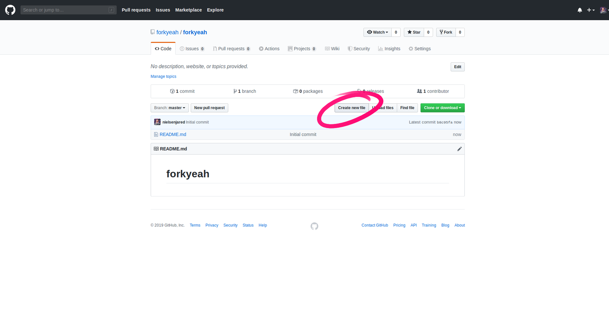

If we want to create new files, and we do, we click the `Create new file` button.

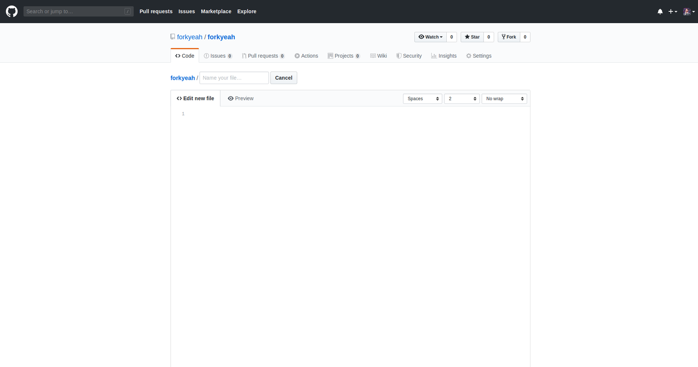

This will route us to a simple text editor where we need to specify the name of the file and its contents. 

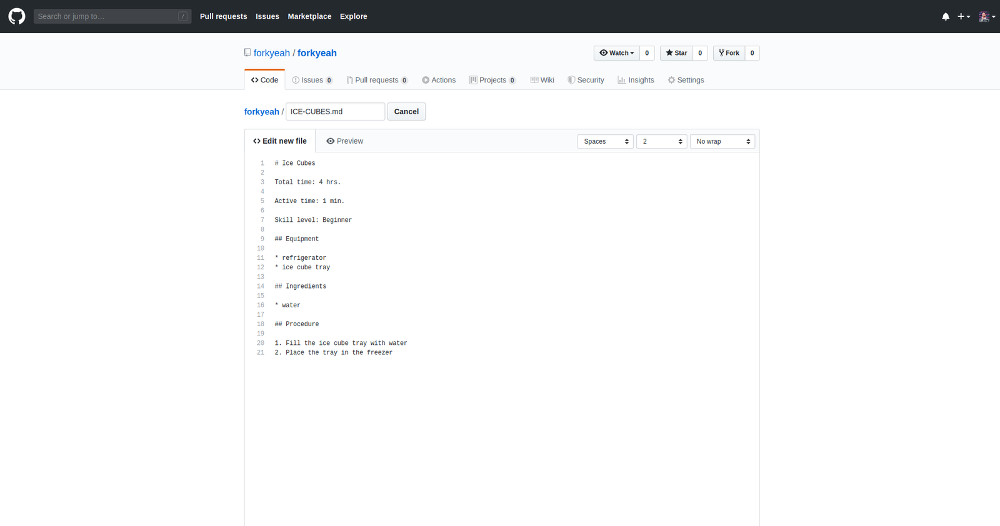

Making ice cubes is the "Hello World" of cooking, so I create a recipe to do so. 

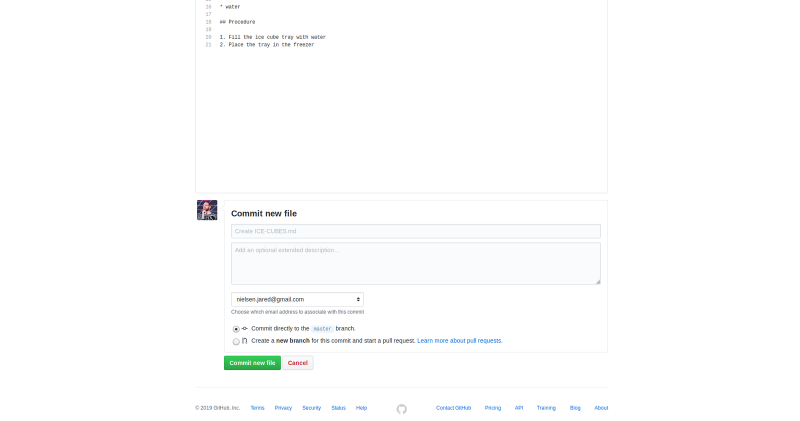

To save our file, we need to scroll down to the bottom of the screen where we can `Commit new file`. 

What's a commit? In order for GitHub to track our file and its change (and who made the changes), we need to _commit_ it to the repository.

Notice the placeholder text in the form field for the title of our commit: 

```
Create ICE-CUBES.md
```

We're going to leave it at that and not add any additional text to our commit message.

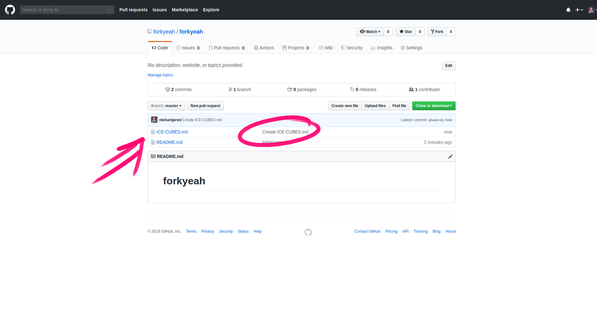

After we commit our new file, we are routed back to our landing page, where we see we now have two files in our repository: our `README.md` and our `ICE-CUBES.md`.

Notice to the right of the `ICE-CUBES.md`, our placeholder commit message. 


To view our newly create recipe, we simply click on its title.

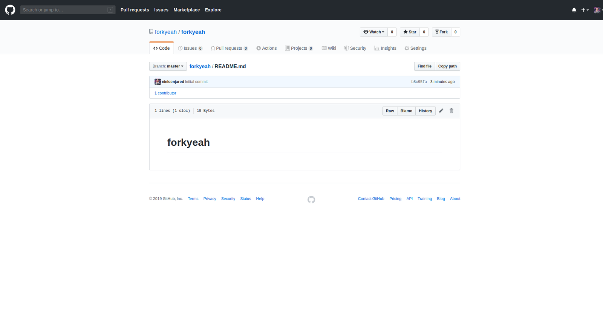

Let's edit a file. The README only contains the title of our repository, so let's add a bit more there. Just like our `ICE-CUBES.md` file above, click on `README.md`.

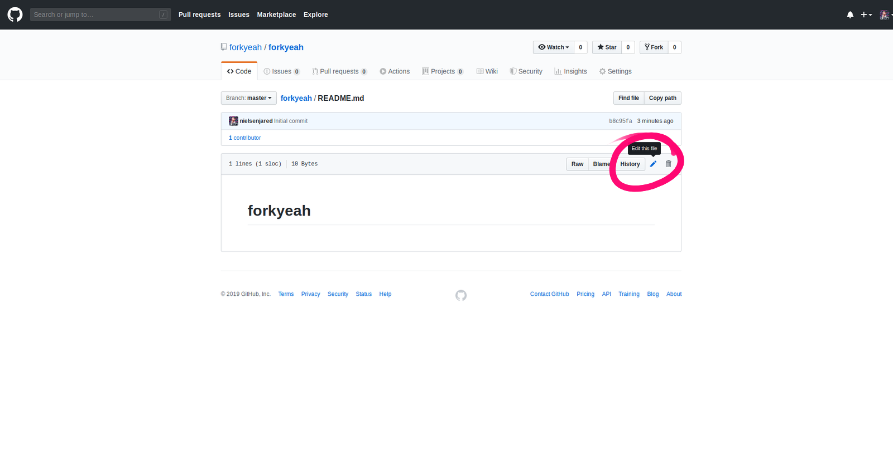

For the time being, I'll add a very brief description and the URL to sign up for the newsletter.

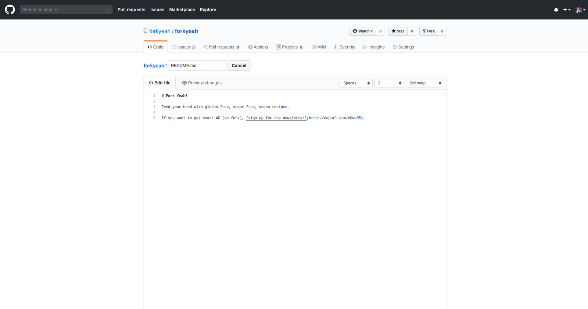

As before, scroll down to the bottom of the screen to commit the changes.

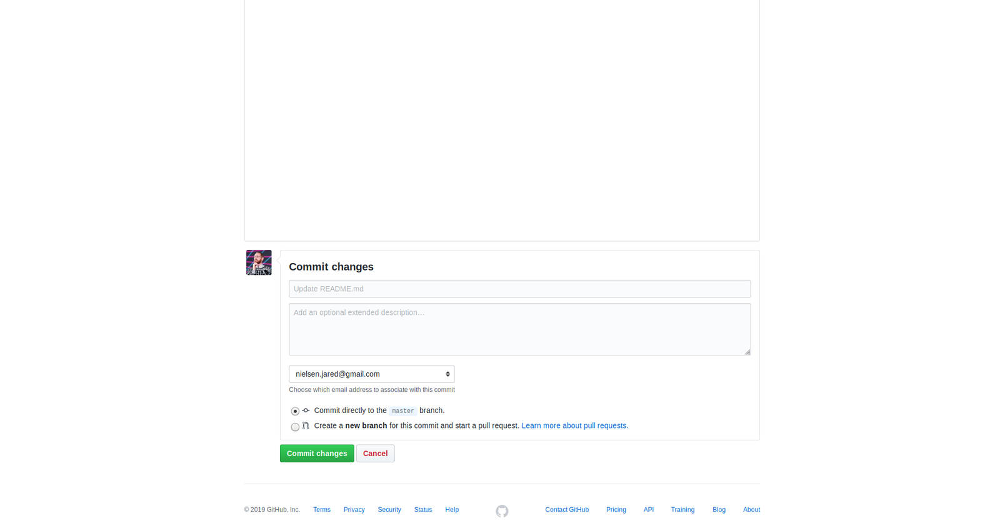

This time, however, let's add our own commit message. 

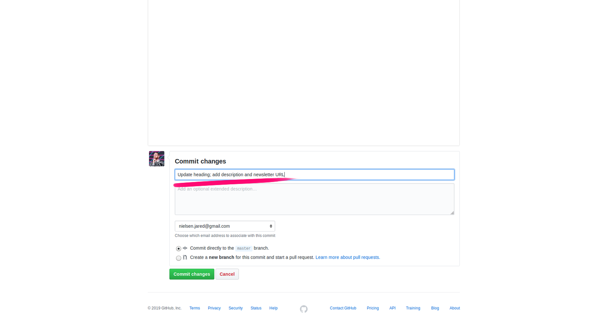

After clicking `Commit changes`, we are routed back to the rendered README. We can see that our changes are reflected in the browser. 

Notice the alert message above our README stating that a new commit was made by me!

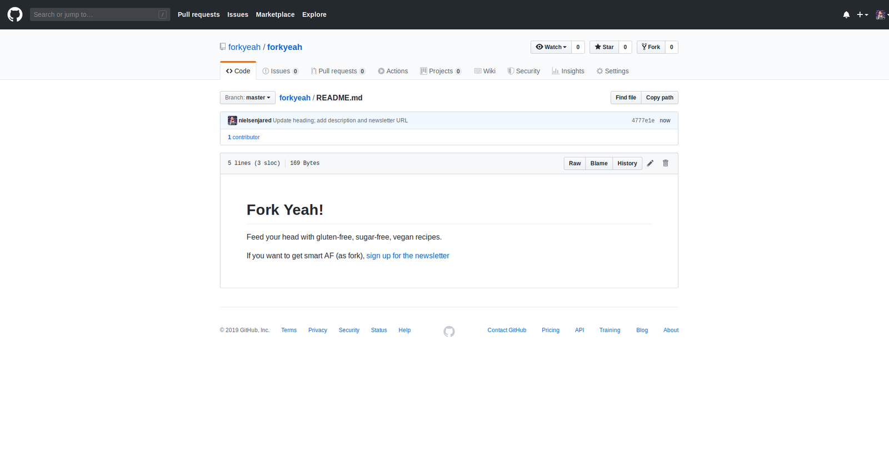

Back at our `forkyeah` landing page, we see next to `README.md` our commit message and a time.

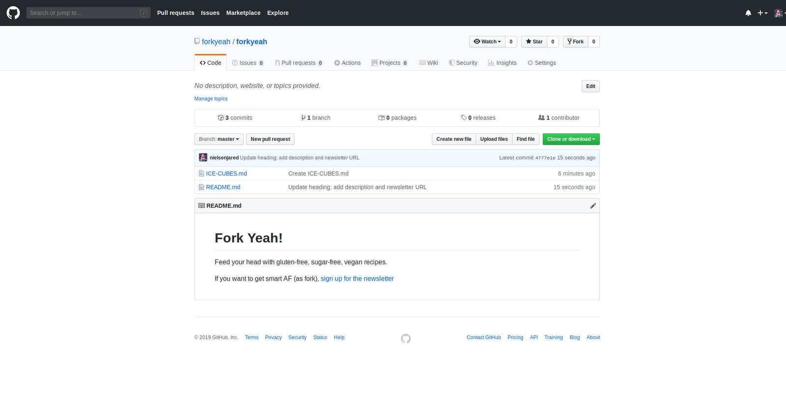

Notice the navigation bar just above our list of files. The first item is a link to the commit log. 

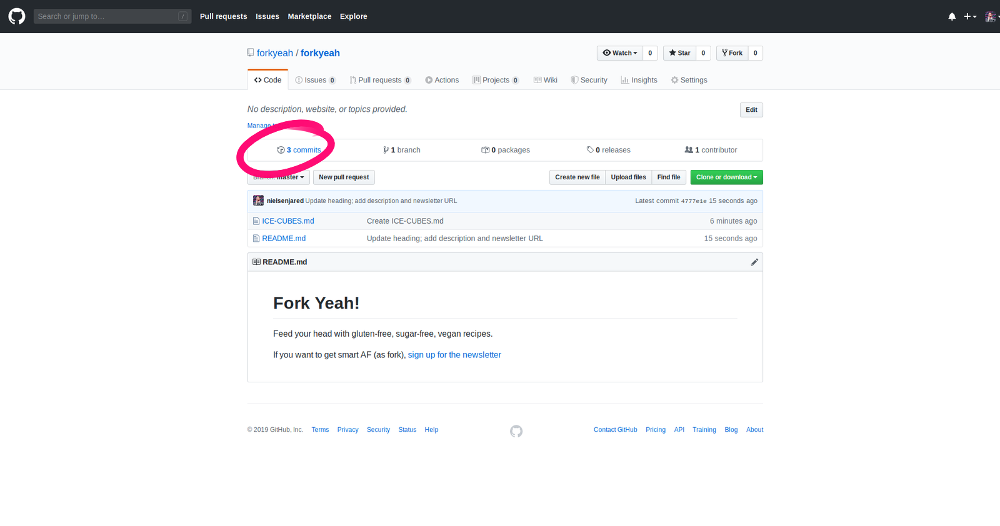

This is the history of our project. We made three commits. 

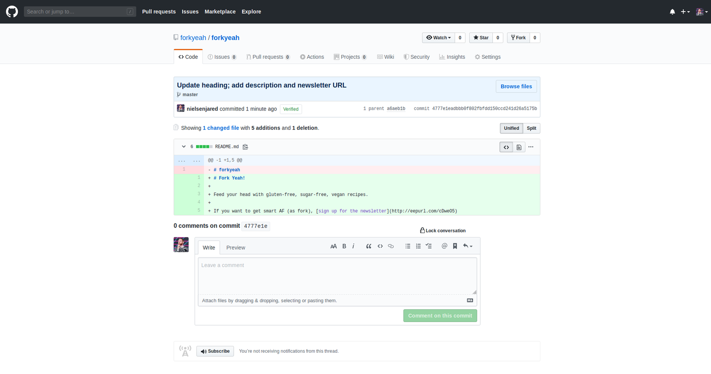

If we click on the title of the most recent commit, we are routed to a page the shows us the changes that were made to the repository in this commit. Fork yeah!


