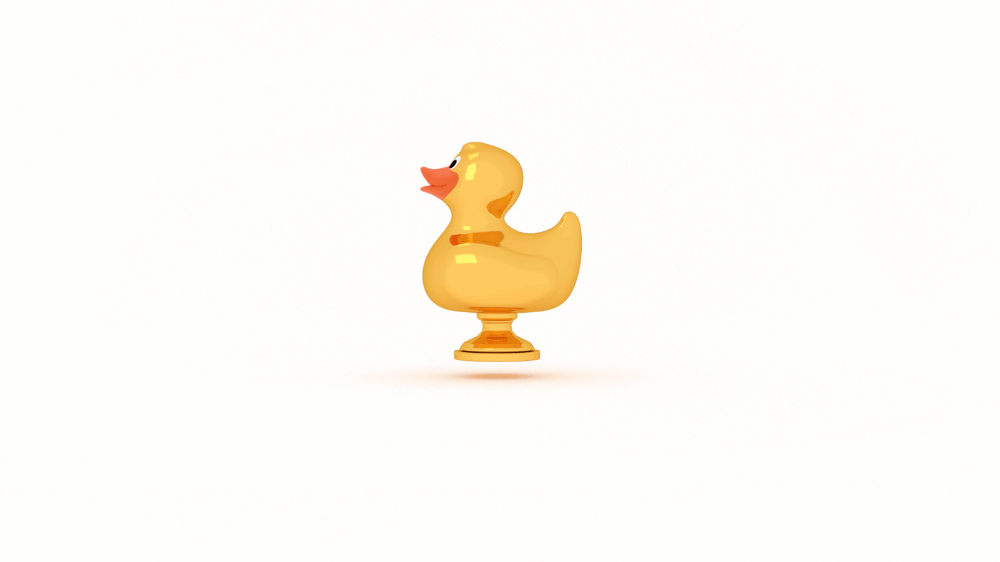

What are you learning this year?

Perhaps we need to reframe the question: _how_ are you learning this year?

Did you make resolutions to learn `x` or build `y` with new hotness `z`?

How’s it going so far?

Most people don’t stick with their resolutions. Something like 80% of people drop their Gregorian calendar goals by Chinese New Year.

Why?

We can boil it down to two factors:

* the goal is too ambitious or too ambiguous or both

* the goal focuses on product, not process

These are two sides of the same coin.

If we clearly define our goals and determine a realistic scope, we can focus on the process.

If we focus on the process, we can achieve amibitious and ambiguous goals.

“That makes for a nice tweet,” I hear you say. “But I need to know this now!”

As the proverb goes, "The best time to plant a tree was 20 years ago. The second best time is now." 

We can't download this stuff into our brains. Yet. 

Our only recourse is to _do the work_. 

Every day. 

To do that, we need to make it a habit. 

According to a [study conducted in 2009](https://onlinelibrary.wiley.com/doi/abs/10.1002/ejsp.674), it takes the average individual 66 days to form a habit. 

Did you already abandon your New Year's resolution? 

If so, you quit too soon.

And that's okay. 

New Year's resolutions are 🐎💩.

But don't wait until January 1st of next year to start again. 

How about now? 

The following are resources to aid you on your journey of setting and achieving your goals: 

* [How to Invest in Your Knowledge Portfolio](https://jarednielsen.com/invest-knowledge-portfolio/)

* [How to Learn Fast and Make Things](https://jarednielsen.com/learn-fast-make-things/)

* [How to Find Motivation](https://jarednielsen.com/motivation-learn-new-skills/)

* [How to Embrace Difficulty](https://jarednielsen.com/embrace-difficulty/)

* [How to Fail Better](https://jarednielsen.com/fail-better/)
