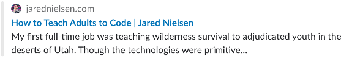
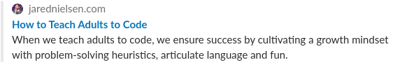

@TODO image
@TODO introduction

The biggest difference between Git fork and pull request workflow and [Git branch workflow](./learn-git-branch-workflow) is that in forking you are working on your own copy of the project and not within the project. You push changes to your fork without changing the original project and then propose your changes to the original project via pull requests.

## Learn Git Fork & Pull Request Workflow: Real World Example

This blog is built with [GatsbyJS](https://www.gatsbyjs.org/), which is a fantastic React-based static site generator. It's still very much in development and so lacking a few things. By default, GatsbyJS generates an excerpt from the first _x_ number of characters in your post, which is not always ideal:



A feature I wanted was the ability to add custom meta descriptions for SEO and Open Graph, to get this result:



This tutorial will walk you through the steps I took to implement this functionality in my blog and open a pull request on the GatsbyJS repository. You can view the PR at [https://github.com/gatsbyjs/gatsby/pull/11936](https://github.com/gatsbyjs/gatsby/pull/11936
)
s
## Fork the Repository

Navigate to the repository you want to fork. If this is your first fork, congrats! Hit the 'Fork' button in the upper right. You will be treated to a delightful animation and redirected back to your account. Note that now the repository is prepended with your username, with a link pointing to the source of the fork just below it.

@TODOD


Now clone your fork.

```sh
git clone git@github.com:nielsenjared/gatsby
```

## Add Upstream

When working with a forked repository, you will want and need to pull changes from the original repo to keep your fork up-to-date. If the original repository is "the source", then, to use a water-based analogy, we could say that it is "upstream", which is what we'll do:

```sh
git remote add upstream git@github.com:gatsbyjs/gatsby.git
```

When you work on the project in the future, simply checkout master and fetch and merge upstream.

```sh
git checkout master
git fetch upstream
git merge upstream/master
```

## Get to Work: Checkout a Branch

When working on a fork to which you intend to submit pull requests, you will want to keep the `master` branch up-to-date and separate from the work you are doing in order to mirror the upstream and minimize conflicts. In this example, I created a branch `meta-description` as that was the feature I was implementing:

```sh
git checkout -b meta-description
```

Work on your feature or bug fix, then add, commit and push to your remote origin.

```sh
git push origin meta-description
```

When submitting a pull request, you won't push directly to the upstream. Instead, you will push your branch to your remote fork and from there open a PR.

## Submitting a Pull Request

After pushing your branch to your remote origin, navigate back to your fork of the repository on GitHub. You should be presented with a notification reporting the title of your recently pushed branch and a GitHub green button to "Compare & pull request".

@TODO


Click that button and you will be routed to a new page on the upstream repository with a form to enter a title and a description for your pull request. Note that your commit message will be auto-populated in the title field, but you can change it.

@TODO


Also note the diff below the form to review your file changes before submitting your PR, which I recommend you do to ensure no errata found its way into your commit.

Write a descriptive title and a brief, articulate explanation of the pull request.

Click `Submit` and your pull request will be added to the queue. You can always return to your PR to edit its title and description. And, if after submitting, you need to make an edit to the PR, just add, commit and push the changes to your fork origin and they will automatically be updated in the upstream.

## @TODO conclusion

## (Re)Sources

* [GitHub Standard Fork & Pull Request Workflow](https://gist.github.com/Chaser324/ce0505fbed06b947d962)
