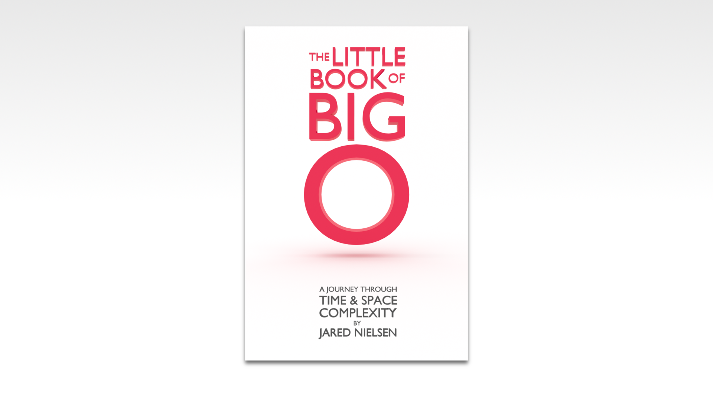

So you need to learn Big O.

You don't really want to, but interviews are scary!

Maybe you picked up a copy of _Cracking the Coding Interview_, but the book, at 687 pages, barely cracks the surface of Big O.

So you Google Big O and find dozens of dense articles with questionable authenticity and accuracy each claiming to be the “ultimate guide” but they only lead you back to where you started.

Or you find yourself popping links off Stackoverflow with most commenters recommending you read the Wikipedia article on Big O Notation, that begins like this:

> Big O notation is a mathematical notation that describes the limiting behavior of a function when the argument tends towards a particular value or infinity.

🙄

To understand that Big O article, you must first understand that Big O article.

It’s time to pull yourself up by your own bootstraps.

The Little Book of Big O will take you on a journey through time and space complexity with examples in JavaScript introducing the following topics:

* O(1)

* O(n)

* O(n^2)

* O(log n)

* O(n log n)

* O(n!)

* Amortized analysis

* Space vs. time complexity

* Recursive time complexity

* Recursive space complexity

* Proof by Induction

* Dynamic programming

* Big Omega & Big Theta

* And more!

It may not be "the ultimate", but it's definitely superlative.

Be O(#1).

Grab your copy of [The Little Book of Big O](https://gum.co/big-o).
