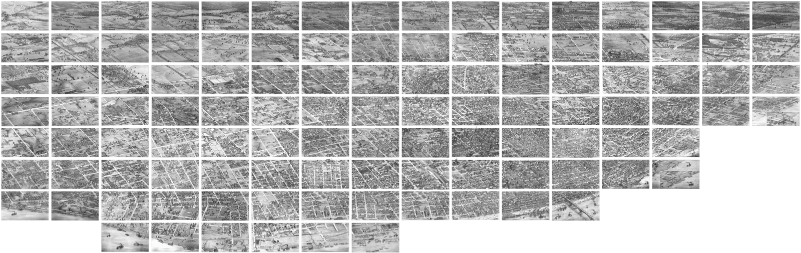

I recently discovered the [Digital Collections](https://www.loc.gov/collections/) archived and made public by the Library of Congress. The collections range from historical photographs and graphic arts to newspaper clippings and maps. I wanted to do something fun with one of these collections and learn some new technology at the same time. The [Pictorial St. Louis collection](https://www.loc.gov/resource/g4164sm.gpm00001/?sp=1) caught my eye.

What I found most interesting about this collection was the scope, the aerial perspective, and the detail of the drawing. I wanted to see all of the drawings stitched together in one large map. So I downloaded all 110 images, cropped and cleaned up the edges, then spliced them together in one massive file: 64000 x 20275 pixels. I could have gone slightly larger, but that was the limit of what the GPU on my laptop could handle. I need the file as large as possible so I would lose very little of the resolution for zooming in on details.



I initially thought I would make a standalone app and I’ve done image processing in the past with Processing and openFrameworks, so I mocked up some tests in both of those, but neither was the right tool. Even a 5000 x 3500 px image was more than Processing could, well, process. And openFrameworks was the long-way to make something very simple. I wanted the drawing(s) to function like a map, with zoom and pan and no loss of resolution.

So I Googled it: ‘How do Google maps work?’

The answer? JavaScript and nested directories of image tiles.

Through a bit more Google Fu, I found [Leaflet.js](http://leafletjs.com/), “an open-source JavaScript library for mobile-friendly interactive maps”.

See the final project [Pictorial St. Louis story map](http://jarednielsen.com/pictorial-st-louis/index.html).

## Non-Geographical Image Maps with Leaflet.js

Leaflet is refreshingly easy to use and lightweight. Take a look at [`index.html` in my GitHub repository](https://github.com/nielsenjared/pictorial-st-louis/blob/master/index.html).

The magic here is happening in the referenced JavaScript files, which are a bit more complicated because I’m using a non-geographical raster image rather than a pre-existing map. I found [leaflet-rastercoords](https://commenthol.github.io/leaflet-rastercoords/), a project that simplifies using raster images as map tiles. (see also: [Github repo](https://github.com/commenthol/leaflet-rastercoords)).

“What’s the big deal with using non-geographical raster images as maps?”, you ask.

For a map to be useful, interactive and interesting, it needs to be big and feature zoom functionality. This is relatively easy to do with vector graphics, which are not really image files, but a set of instructions for how to draw shapes and lines, or with pre-existing tile libraries, like MapBox. Raster images, on the other hand, are bitmaps, which means every pixel of the image is assigned a value. So raster image files are generally much larger than vector image files because they contain more information. As I’m sure you are well aware, big images on a site take time to load, especially on a mobile device.

## Story Mapping with Leaflet.js

While I was searching GitHub for ideas and examples of Leaflet projects, I found [Jack Dougherty’s excellent storymap repo](https://github.com/jackdougherty/leaflet-storymap) (If you want to learn more, check out his free book, Data Viz For All.) This was the perfect way to easily make Pictorial St Louis interactive, and most important, interesting, so I hacked leaflet-rastercoords together with leaflet-storymap.

Next I needed a story to tell. My first step was to Tweet at [LCMaps](https://twitter.com/LOCMaps) and [STLMapRoom](https://twitter.com/STLMapRoom)…

<blockquote class="twitter-tweet" data-lang="en"><p lang="en" dir="ltr">Hey <a href="https://twitter.com/STLMapRoom?ref_src=twsrc%5Etfw">@STLMapRoom</a> I made a map using Dry&#39;s 1875 drawings from <a href="https://twitter.com/LOCMaps?ref_src=twsrc%5Etfw">@LOCMaps</a> Can anyone help me with context/background? <a href="https://t.co/uMfmLZwYZV">https://t.co/uMfmLZwYZV</a></p>&mdash; Jared Nielsen (@jarednielsen) <a href="https://twitter.com/jarednielsen/status/862307223334268929?ref_src=twsrc%5Etfw">May 10, 2017</a></blockquote>
<script async src="https://platform.twitter.com/widgets.js" charset="utf-8"></script>


The LCMaps account referred me to the [Ask a Librarian](https://www.loc.gov/rr/askalib/) service provided by the Library of Congress. I submitted a question and three days later received a response with attached pdfs scanned from books providing history and context for both panoramic maps and the artist of Pictorial St. Louis, Camille N. Dry.

Then I spent a few days researching Dry and late 19th Century St. Louis. I found some excellent resources:

* [Lucas and Garrison 1875](http://lucasandgarrison.com/homepage/introduction/the-maps/)
* [History Happens Here — The Missour History Museum’s Blog](http://www.historyhappenshere.org/node/7694)
* [Distilled History](https://www.distilledhistory.com/)
* [City of St. Louis Archive](https://www.stlouis-mo.gov/archive/neighborhood-histories-norbury-wayman/bissell/works4.htm)
* [Keen Delage via Flickr](https://www.flickr.com/photos/73762611@N00/5992654457)

It was then simply a matter of ‘writing’ a story and filling in the blanks in maps.geojson.

## DIY: Make an Interactive Story Map Using Leaflet.js and Non-Geographical Images

Making your own story map with Leaflet.js and non-geographical images is super easy. The instructions below assume your are using a Unix-based command line.

Download or clone this repo: https://github.com/nielsenjared/pictorial-st-louis

### ImageMagick

This approach is a bit ridiculous and convoluted, but it’s my quick-and-dirty workaround for the Github file size limit of 100MB (The full .png is ~900MB). You need to stitch together the complete map from the slices included in the maps directory and then slice that file into tiles.

I know.

If you don’t have it already, install ImageMagick:
```sh 
sudo apt-get install imagemagick
```

Change into the maps directory:
```
cd maps
```

And run
```sh 
convert \( 01.png 02.png 03.png 04.png 05.png 06.png 07.png 08.png +append \) \
 \( 09.png 10.png 11.png 12.png 13.png 14.png 15.png 16.png +append \) \
 \( 17.png 18.png 19.png 20.png 21.png 22.png 23.png 24.png +append \) \
 \( 25.png 26.png 27.png 28.png 29.png 30.png 31.png 32.png +append \) \
\( 33.png 34.png 35.png 36.png 37.png 38.png 39.png 40.png +append \) \
 -append ../map.png
```
This will generate map.png in the parent directory.
```
cd ..
```
In case you’re interested, I spliced the original with this snippet:
```
convert key.png -crop 8000x4055 %04d.png
```

### Making Tiles

I used a Python script to create my raster tiles. https://github.com/commenthol/gdal2tiles-leaflet

First, you will need to install GDAL:

```
sudo apt-get python-gdal
```

Next, download or clone gdal2tiles.py:
```
git clone https://github.com/commenthol/gdal2tiles-leaflet.git
```

The README explains how to determine optimal zoom level:
```
echo “l(x/256)/l(2)” | bc -l
```
Where ‘x’ is the width of the image you want to tile.

So in my case
```
echo “l(64000/256)/l(2)” | bc -l
```
Returned
```
7.96578428466208704368
```
Round up. Mine is 8.
```
cd gdal2*
```
Next run
```
python gdal2tiles.py -l -p raster -z 0–8 -w none ../map.png ../tiles
```

This will generate a series of nested directories populated with image tiles in a new directory, ‘tiles’.
```
cd ..
```
That’s it! Open index.html in a browser.

See it live here: http://jarednielsen.com/pictorial-st-louis/index.html