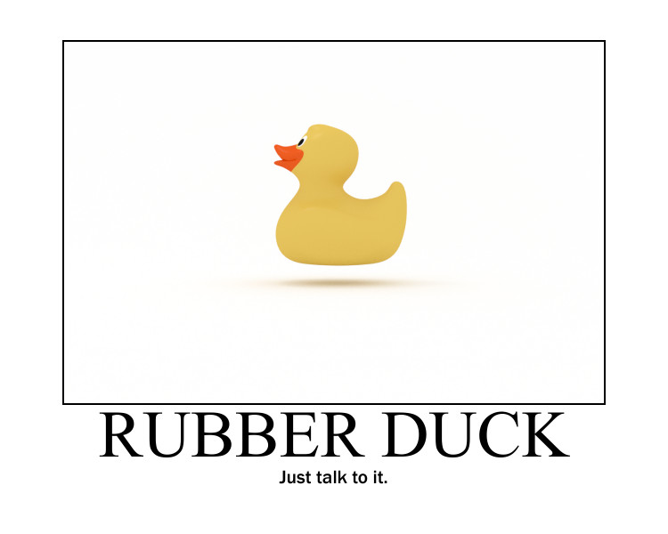

How do you stay motivated? Especially in a year like this one. 

## What is Motivation? 

Why do we do what we do? Because we want to do it or because someone tells us to do it? This is the difference between instrinsic and extrinsic motivation. 

In [Drive](https://amzn.to/2IcdJnD), Daniel Pink defines and defines two personas that characterize these two behaviors:

* Type X, which is "...fueled more by extrinsic desires than intrinsic ones. It concerns itself less with the inherent satisfaction of an activity and more with the external rewards to which the activity leads."

* Type I, which is … is fueled more by intrinsic desires than extrinsic ones. It concerns itself less with the external rewards to which an activity leads and more with the inherent satisfaction of the activity itself."

Pink adds further distinctions:

* Type I behavior is made, not born.

* Type I’s almost always outperform Type X’s in the long run.

* Type I behavior does not disdain money or recognition.

* Type I behavior is a renewable resource.

* Type I behavior promotes greater physical and mental well-being. 

According to Pink, there are three "nutrients" required for self-directed growth: 

* Autonomy

* Mastery

* Purpose

@TODO say something about ^^^

In [Ultralearning](https://amzn.to/33IZMF0), Scott Young counsels us to answer the question, ‘Why?’ 

Why do we want or need to learn something? 

He divides projects into two types of motivation: 

* Instrumental

* Intrinsic

According to Young, "Instrumental learning projects are those you’re learning with the purpose of achieving a different, nonlearning result". These projects are primarily for the benefit of your career. This is in contrast to intrinsic projects where "you’re learning the subject for its own sake, not as a means to some other outcome." He offers a word of advice:

> If you’re pursuing a project for mostly instrumental reasons, it’s often a good idea to do an additional step of research: determining whether learning the skill or topic in question will actually help you achieve your goal. 

## Why Do We Want to Be Intrinsically Motivated? 

Why would we want to favor intrinsic motivation over extrinsic, instrumental motivation? 

Mihaly ‎Csikszentmihalyi provides an answer in [Flow](https://amzn.to/35NmVb3): 

> There is no question that to survive, and especially to survive in a complex society, it is necessary to work for external goals and to postpone immediate gratifications. But a person does not have to be turned into a puppet jerked about by social controls. The solution is to gradually become free of societal rewards and learn how to substitute for them rewards that are under one's own powers. This is not to say that we should abandon every goal endorsed by society; rather, it means that, in addition to or instead of the goals others use to bribe us with, we develop a set of our own. 

Steve McConnell maps this to a real-world object in [Code Complete](https://amzn.to/2JCCarc):

> Your employer can’t force you to be a good programmer; a lot of times your employer isn’t even in a position to judge whether you’re good. If you want to be great, you’re responsible for making yourself great. It’s a matter of your personal character.

And Dave and Andy reiterate this point in [The Pragmatic Programmer](https://amzn.to/30BVrAW):

> It’s your life. You own it. You run it. You create it. 

They continue: 

> You are building the future, for yourselves and for your descendants. Your duty is to make it a future that we’d all want to inhabit. Recognize when you’re doing something against this ideal, and have the courage to say ‘no’! Envision the future we _could_ have, and have the courage to create it. Build castles in the air every day. 

## How Do We Stay Motivated?

Stay motivated? Easier said than done. Especially in a year like this one. 

In [Ultralearning](https://amzn.to/33IZMF0), Scott Young defines three problems that prevent us from focusing:

* Failing to start to focus (AKA procrastination)

* Failing to sustain focus (AKA getting distracted). The sources that cause distractions:

    * Your environment

    * Your task

    * Your mind

* Failing to create the right kind of focus

Why do we procrastinate? 

According to Barbara Oakley in [A Mind for Numbers](https://amzn.to/2UWpClG), "We procrastinate about things that make us feel uncomfortable." Like learning a programming language. 

How do we improve our ability to focus? 

According to Young, the first step to overcoming procrastination is to "recognize when you are procrastinating" and to "start small". 
@TODO ^^

In [A Mind for Numbers](@TODO), Barbara Oakley offers strategies for preventing procrastination. The first is to harness your willpower:

> Unlike procrastination, which is easy to fall into, willpower is hard to come by because it uses a lot of neural resources. This means that the _last_ thing you want to do in tackling procrastination is to go around spraying willpower on it like its cheap air freshers. You shouldn’t waste willpower on procrastination except when absolutely necessary!

A second strategy proposed by Oakley is to focus on process over product: 

> If you find yourself avoiding certain tasks because they make you uncomfortable, there is a great way to reframe things: Learn to focus on _process_, not _product_. The product is what triggers the pain that causes you to procrastinate. Instead, you need to focus on the _process_, the small chunks of time you need over days or weeks.

In [Drive](https://amzn.to/2IcdJnD), Pink outlines **Nine Strategies for Awakening Your Motivation**:

1. **Give Yourself a “Flow Test”**: For a day, or a week, set random alarms on your phone to prompt you to assess your engagement in the activity at hand. Keep score and at the end of your testing period, ask yourself: "How might you increase the number of optimal experiences and reduce the moments when you felt disengaged or distracted?"

2. **First, Ask A Big Question…**: That big question is, "What’s your sentence?" In one sentence, how would you summarize the legacy you want to leave? If you sentence runs on, you are spreading yourself too thin (i.e: distracted).  

3. **… Then Keep Asking A Small Question**: That smaller question is, "Was I better today than yesterday?" Look for incremental gains. Never stop improving!

4. **Take a Sagmeister**: Stefan Sagmeister is a designer who takes a sabbatical every seven years to travel and pursue interests not directly related to his work. The break allows him to reset and return to work reinvigorated. You may not be able to take a year off every seven, but can you take one day per week? 

5. **Give Yourself a Performance Review**: The standard corporate performance review occurs every six months. The feedback delivered in these sessions is usually not useful by the time it is received. So give yourself a performance review on a more frequent schedule. Assess where you are succeeding and where you need to improve, then act on it. 

6. **Get Unstuck by Going Oblique**: Brian Eno and Peter Schmidt developed a deck of cards they used to unblock their creativity. When they felt stuck, they would draw a card and follow the instructions on it, such as "State the problem in words as clearly as possible." and "Try faking it!"

7. **Move Five Steps Closer to Mastery**: How do you gain expertise? Practice makes practice.

8. **Take a page from Webber and a Card From Your Pocket**: Fast Company's Alan Webber developed a strategy to help him focus. On a 3x5 card, answer the question, "What gets you up in the morning?" And on the back of the card, answer the question, "What keeps you up at night?" If the two answers are not in alignment, it's a sign that you need to change something. 

9. **Create Your Own Motivational Poster**: Like the one at the top of this post!

In [Code Complete](https://amzn.to/2JCCarc), Steve McConnell offers a list of strategies for developers: 

* Build your awareness of the development process

* Experiment

* Read about problem solving

* Analyze and plan before you act

* Learn about successful projects

* Read!

* Read other books and periodicals

* Affiliate with other professionals

* Make a commitment to professional development

Notice he recommends a lot of reading!

## Conclusion

@TODO
