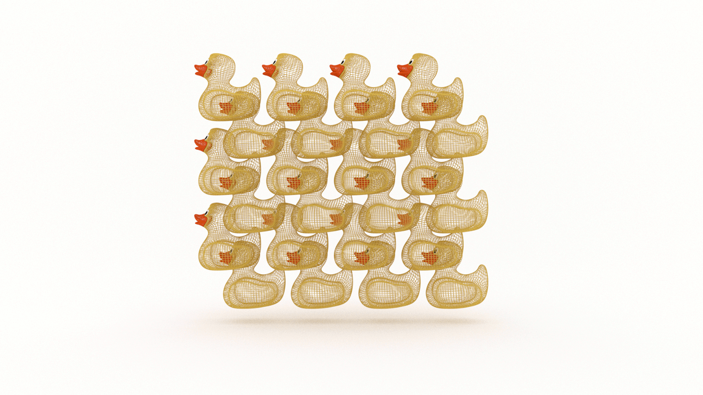

TODO introduction 
computational thinking 

Once upon a time, there was a young boy named Carl Friedrich Gauss. He lived in the city of Brunswick with his working-class parents and was a precocious child.

One day, young Gauss made a legendary discovery.

It happened in math class.

Little Carl was ten years old.

Knowing it would take some time to complete, the teacher gave the students a problem:  _find the sum of the whole numbers between 1 and 100._

This was the 18th century version of turning on a movie. 

While his peers busied themselves diligently adding integers one at a time on their slate boards, young Gauss shortly raised his hand with the solution. 

5050. 

(Sorry. Were you still adding?)

The teacher was astounded. 

The students cheered! 

They raised Little Carl on their shoulders and flooded the streets. The townsfolk all streamed out of their houses and shops to join the parade. The young Gauss was declared a national hero for delivering Germany from the drudgery of manual addition of consecutive integers.

Okay. 

That last part didn’t happen. 

But Gauss did go on to become one of the most influential mathematicians in history. 

How did ten year-old Gauss do it? 

He saw an elegant solution to a rote problem: the relationship between the numbers rather than the numbers themselves. 

AKA pattern recognition. 

Pattern recognition is the second stage in the four step process of computational thinking: 

* Decomposition

* Pattern recognition

* Abstraction

* Design, or pattern forming

If you're just joining us, you'll want to start with the first article in this series, [How to Break Down a Problem: A Guide for Decomposition in Computational Thinking](TODO).

## What is pattern recognition? 

According to Ye Olde Wikipedia, _pattern recognition_ is: 

> a cognitive process that matches information from a stimulus with information retrieved from memory.

That's in the [context of human psychology](https://en.wikipedia.org/wiki/Pattern_recognition). In the [context of engineering](https://en.wikipedia.org/wiki/Pattern_recognition), _pattern recognition_ is: 

> the automated recognition of patterns and regularities in data

We want to concern ourselves with the former in order to accomplish the latter. 

TODO what is pattern recogntion? Sparks of Genius? 

## How does pattern recognition work?

TODO 
In _The Power of Computational Thinking_, authors Curzon and McOwan state that: 

> Often problems turn out to be essentially the same as something you've already seen in a different situation. If you already have a solution for that other problem, then you can just reuse it. 

Great! But how do we get those solutions? 

We build a library of patterns! 

This requires us to do one (but preferably both) of two things: 

* Study

* Practice 

😩

### Learn how to recognize patterns and anti-patterns 

How do you shortcut your way to success? 

If success is a ladder, the quickest way to reach the top is to stand on the shoulders of giants. 

Those giants learned things the hard way and, lucky for us, they shared what they learned.

Unfortunately, there’s no shortcut to the shortcut. We need to do the work and learn those lessons, too.

We need to learn design patterns. 

A design pattern is a reusable solution for a problem. We’re accustomed to design patterns in terms of computer science, but the concept originates from architecture, and can be applied to any domain.

We also need to learn what didn't work. 

The opposite of design patterns are anti-patterns. An anti-pattern, as defined by Gabriel Weinberg in _Superthinking_, is “...a seemingly intuitive but actually ineffective ‘solution’ to a common problem that often already has a known, better solution”. 

How do we avoid anti-patterns? First, we need to learn them. Then, according to Weinberg, we avoid them by “...explicitly looking for them and then seeking out established patterns instead.” 

This is the #1 reason we want to study algorithms, even the poor performers. We build a library of mental models that help us quickly recognize design patterns and anti-patterns. 

When learning algorithms, there are two primary reasons we always start with sorting. The first is that a sorted array is a prerequisite for many other algorithms, such as search. The second is that, according to Donald Knuth in _The Art of Computer Programming_, “...sorting algorithms make a valuable case study of how to attack computer programming problems in general.” He continues:

> Sorting techniques also provide excellent illustrations of the general ideas involved in the analysis of algorithms--the ideas used to determine performance characteristics of algorithms so that an intelligent choice can be made between competing methods. 

### Learn how to recognize patterns through problem solving and play

Practice. 

TODO

Karl Beecher offers an approach for spotting simple patterns in _Computational Thinking_: 

* Look for nouns that appear repeatedly. These could correspond to objects that your solution deals with. 

* Looks for verbs that appear repeatedly. These could be operations that the solution carries out. 

* Look for concrete descriptions. These could probably be substituted by placeholders that vary in different situations. For example: 

    * adjectives ('red', 'long', 'smooth') which indicate properties of things and could be replaced by the property name (colour, size, texture);

    * actual numbers, which could be replaced with variables. 

TODO Karl Beecher in _Computational Thinking_:

* Patterns among a sequence of instructions can be generalised into loops

* Patterns among separate groups of instructions can be generalised into subroutines 

* Patterns among conditionals or equations can be generalised into rules 

TODO

According to Barbara Oakley in _A Mind for Numbers_: 

> Half of mastering mathematics is simply recognizing the type of problem-solving pattern that applies to each problem. 

The same can be said of programming. 

Design patterns are an obvious answer.

And Big O. 

An understanding of time complexity, data structures, and algorithms will help you see through a programming problem and immediately identify the order of any function. 

For example, any time you encounter a nested loop, you know that’s O(n^2) (or worse) and you know there must be a better way!

Pattern recognition is a skill you need to develop and maintain.

Yes, that means learning your data structures, practicing algorithms, and studying Big O.

It also means having fun. 

TODO Sparks of Genius: 
“Recognizing patterns sometimes requires a certain amount of tolerance for dawdling and play.”

Make up jokes. 

Pun. 

Doodle.

Read poetry.

Play checkers.

Play chess.

Play video games.

Do crossword puzzles. 

Or jigsaw puzzles.

Or climb rocks!

TODO Sparks of Genius
“Like a good riddle, such nonsense at any age may be a nuisance that reveals new sense.”

No excuse. You now have permission.

Go play!

#### Focused vs. diffuse mode

Ever found yourself in this situation? 

You’re troubleshooting a bug.

You go down the rabbit hole.

🐇🕳️

You open so many browser tabs you can’t read the titles anymore.

You find yourself on the second page of Google search results. 

You start cross-referencing comments on Stack Overflow.

You talk to the duck. 

It only quacks back at you.

So you step away.

And take a walk.

Or a nap.

Maybe you play a game. 

Or chat with a friend.

And 💥!

Eureka!

There’s the solution. 

All you needed to do was get out of your own way.

In _A Mind for Numbers_, Barbara Oakley outlines two modes of thinking: _focused_ and _diffuse_.

Focused-mode thinking “involves a direct approach to solving problems using rational, sequential, analytical approaches. The focused mode is used to concentrate on something that's already tightly connected in your mind, often because you are familiar and comfortable with the underlying concepts.”

Diffuse mode thinking “is what happens when you relax your attention and just let your mind wander. It allows us to suddenly gain a new insight on a problem we’ve been struggling with and is associated with ‘big-picture’ perspectives.”

Both modes are essential to problem solving.

“Evidence suggests that to grapple with a difficult problem, we must first put hard, focused-mode effort into it. Here’s the interesting part: The diffuse mode is also often an important part of problem solving, especially when the problem is difficult. But as long as we are consciously focusing on a problem, we are blocking the diffuse mode.”

Sometimes trying too hard is part of the problem.

We become our own blocker. 

This is called the Einstellung effect.

“In this phenomenon, an idea you already have in mind, or your simple initial thought, prevents a better idea or solution from being found.”

Why do we do this to ourselves? 

Ego.

It's Freudian.

“The ego and superego suppress ideas by judging them to be somehow out of order as they try to work their way up to the conscious level.” 

In _Conceptual Blockbusting_, James L. Adams continues:

> Judgment is clearly necessary in life, but it is often automatic. It’s not hard to see why: life becomes simpler if one makes rapid judgments, and a person is rewarded if those judgments are later seen to be right. But premature judgment can be the enemy of creativity. You are undoubtedly familiar with that by the common phenomenon of a better idea that emerges just as soon as you commit to another one.

Programming is problem solving. 

Both programming and problem solving are metacognitive activities. 

The key to lifelong success is in a two-fold process of reflection and remodeling, or, learning how to think about thinking.

We will have intuitions about how our programs should work but we may be surprised and frustrated by evidence that it does not work.

Bugs! 🐛

“This kind of wrong approach is especially easy to do in science because sometimes your initial intuition about what’s happening is misleading. You have to unlearn your erroneous older ideas even while you’re learning new ones.” 

Ultimately, what each of us needs is a better understanding of ourselves. 

Why did you think this approach would or would not work? 

Why do you think it does or doesn’t? 

What does this situation reveal to you about your assumptions and intuitions? 

Your judgments? 

Bugs are “an intrinsic part of the learning process”, not something to be avoided. 

It is through debugging that we learn the most about ourselves.

We want the runtimes of our programs to be efficient. 

We also need to be concerned with our own runtimes. 

Brute force will work, but there’s not always enough time (in the day) or space (in your head) to do it!

Lucky for us, our brains are hard-wired to solve problems without us even trying.

"If you are trying to understand or figure out something new, your best bet is to turn off your precision-focused thinking and turn on your 'big picture' diffuse mode long enough to be able to latch on to a new, more fruitful approach."

But we first need to establish patterns using focused-mode thinking.

"If you are grappling with a new concept or trying to solve a new problem, you don’t have preexisting neural patterns to help guide your thoughts--there’s no fuzzy underlying pathway to help guide you."

## Metapatterns 

Once we build a library of patterns and a TODO ability to recongize them, we can begin to recognize patterns of patterns, or _metapatterns_. 

Take topological sort, for example. 

We use it every day to make decisions and perform actions in sequence, often starting when we get dressed in the morning. Unless you are a superhero, you probably put your underwear on before your pants.

One of the classic analogies for topological sort is academic curriculum. If you want to earn a computer science degree, for example, you need to take CS101 before you can take CS102. There might be some other prerequisite for CS102, such as Linear Algebra, but you can take it at the same time as CS101. Completion of CS102 will open up a new range of courses to take, some with their own prerequisites. You then proceed course-by-course down your career path! 

Whether or not you earn a CS degree, there’s a good chance the only time you will ever write a topological sort algorithm is in an interview. But that doesn’t mean you don’t need to learn it! Like topological sort, to understand our field, we sometimes need to traverse all of the paths. Doing so will increase the breadth of our knowledge and put dependencies in context as well as order, but it doesn’t necessarily mean we need to go in-depth on each topic. (See what I did there?) Additionally, and perhaps most importantly, we strengthen our ability to recognize patterns. Topological sort is like DFS experiencing an identity crisis and confusing itself with BFS. But to see that, you would first need to learn DFS and BFS. A visual analogy for this form of pattern recognition is a moiré pattern, where two patterns overlap to reveal a third, new pattern, like this: 

TODO 

## How to Recognize Patterns 

TODO