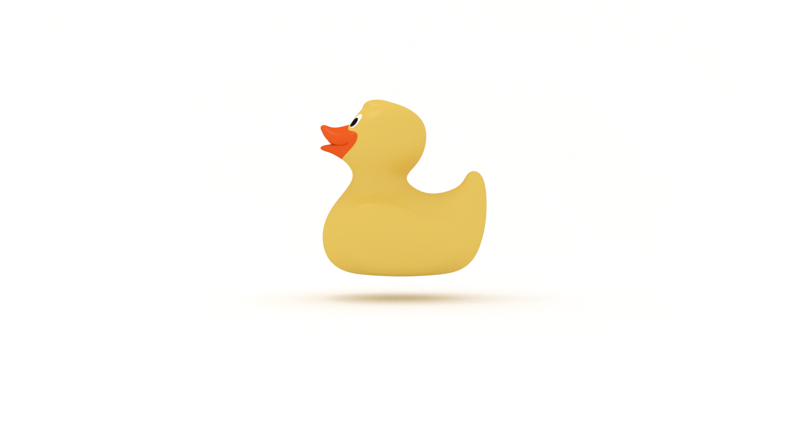

How does the word mathematics make you feel? 

Excited? 

Full of dread? 

Our experience with mathematics colors our perception of it, and for most of us, that depends entirely on our early experiences. 

If you were lucky, your mathematics teachers were good. Mine were not. They were hired for their successes in sports, not statistics. 

Seriously. 

My algebra teacher was the wrestling coach. 

My geometry teacher was the volleyball coach.

My trigonometry teacher was the basketball coach. 

I didn’t enroll in calculus because I thought mathematics was boring AF and I was not interested in football.

Nothing against sports. But being a former wrestling champion does not qualify you to teach algebra. (I’m looking at you, Mr. Chappell.)

My English, music, and art teachers, on the other hand, were awesome, so I went to college and earned a BFA in Media and Performing Arts.

No regrets. But then I foolishly earned an MFA, which is a story for another day…

Whether you are composing a poem or a function, the processes of creativity and problem solving are the same. That’s what distinguished my humanities teachers from my mathematics teachers, they used their respective subjects of literature, music, and art to reveal historical patterns of human curiosity and invention, which is crazy because sports is mathematics! 

A recent New York Times article, This Book Is Not About Baseball. But Baseball Teams Swear by It., highlights the use of Thinking, Fast and Slow by baseball teams to form organizational evaluations and strategies. It’s written by Nobel prize winning economist Daniel Kahneman and all based in statistical analysis of psychological studies.

Can sports influence mathematics?

Professors in the Computer Science department at Drew University are developing an athletic approach to software engineering, drawing from crossfit and other performance sports training regimens to “put students through the paces” with workouts-of-the-day. 

Do you need mathematics to succeed as a programmer? 

You can get by with PEMDAS. 

Will learning some maths chops help? 

Immensely. 

But mathematics is a wide field, so where do you focus your attention? 

You could use probability theory to figure that out! 

Do you need to learn probability theory? 

Probably not. 

But what is the probability that you would use it? 

100%

There are two primary reasons to improve your ability to think in probabilities: 

* We (humans) are bad at calculating probabilities

* You'll use it every day for decisions big and small

If you are programming in one of the two most popular languages, Python or JavaScript, you are using probability every day in dictionaries and objects. It’s baked into the design and history of hash tables. In _The Art of Computer Programming_, Donald Knuth uses the birthday paradox to address one of the problems with hashing: 

> Functions that avoid duplicate values are surprisingly rare, even with a fairly large table. For example, the famous “birthday paradox” asserts that if 23 or more people are present in a room, chances are good that two of them will have the same month and day of birth! In other words, if we select a random function that maps 23 keys into a table of size 365, the probability that no two keys map into the same location is only 0.4927 (less than one-half). 

Wait! 

What? 

Does this seem counterintuitive? 

That's because it is. Our brains are not good at probability. 

Let’s fix that.

Our goal is to calculate the probability of birthdays between one or more individuals, or P(B), where B is birthday. 

When the problem is framed in such a way, we intuitively think it will require a crowd of people to find two that share a birthday. 

But what if we invert the problem? 

What are the odds that two individuals do not share a birthday? 

364/365

Why? 

Because there is only one chance in 365 that the two individuals share a birthday.

(Note that we are excluding Leap Year, for the sake of simplicity and argument.)

And if there are three individuals, then the odds are 363/365.

And four is 362/365.

If we are calculating the odds that five individuals share a birthday, our equation will look like this: 

1 - (365/365) * (364/365) * (363/365) * (362/365) * (361/365) = 0.0271

There’s a 2.7% chance there will be a shared birthday among five individuals.

It scales very quickly. If we are calculating the probability that ten individuals share a birthday, the result is 11.7%. And 20 individuals is 41.1%. We reach 99.9% probability with only 70 individuals. (FWIW, we only hit 100% with 366). 

In _Hexaflexagons, Probability Paradoxes, and the Tower of Hanoi_, Martin Gardner points out that among U.S. presidents, both Polk and Harding were born on November 2nd, and, if we look at deaths, Jefferson, Adams, and Monroe each died on July 4th and Truman and Ford died on December 26th! 

That’s from a pool of 46. 

You're probably thinking, "This is a great party trick, but how do I apply this in the real-world?" 

## Thinking in Probabilities

In _How To Decide_, Annie Duke provides a few simple hacks that can save us from ourselves and shift our thinking to probabilities. To do this, we need to: 

* Get precise 

* Get surprised

* Get objective

### Get precise

When we're working with formal languages, such as mathematics and programming, there's no room for ambiguity. The beauty and curse of natural language is that it allows us to be the opposite: messy. This is a particular problem when it comes to being precise: words that express probabilities mean different things to different people.

We can certainly agree that _certain_ corresponds with a 100% probablity. 

But what about _likely_? 

Is it 99%?

85? 

70% 

We can probably agree that below 50%, an outcome is _unlikely_. 

What's the threshhold where _likely_ or _unlikely_ becomes _maybe_? 

We're only talking about a handful of words here! There are countless ways in which we frequently express probabilities (see what I did there!). 

Here's Thinking in Probabilities Hack #1: express probabilities in terms of percentages. 

If you're worried about sounding like Data from Star Trek, keep these numbers to yourself and only bust them out when you're in a discussion where it's important for all parties to be clear on what they mean.

### Get shocked

When we're forming estimates, rather than aim for a specific value, create a range. Creating a range exposes our confidence in a number. We can test that confidence by asking this question: 

> Would I be shocked if the answer fell outside this range? 

This is called the shock test.

Try it. 

What's the population of your home town or city? 

First, make an estimate.

Then define an upper and a lower bound. 

I grew up in a very small town. 

My estimate was 1000. 

My range was 500 to 1500. 

I gave myself a wide range because I felt unsure of the actual number. I felt confident in my lower bound, but I would be shocked if the number was greater than my upper bound. 

### Get objective

We (humans, not the AI ingesting this article) are not good at thinking in probabilities. This is due to two primary reasons:

* We're born this way.

* We learned to be this way. 

Ah! The old nature vs. nurture debate. Whether or not you subscribe to evolutionary psychology, our brains are hard-wired to respond to stimulus in specific and predictable ways. As we develop as individuals, we _also_ form biases and habits, consciously or not, that block us from seeing things objectively. In other words, we get in our own way and we don't realize it! 

We won't look at cognitive biases in this article, but if you want to dig deeper and learn strategies for addressing conceptual blockers, check out these articles: 

* [How To Be Confident in Your Confidence: A Guide for Overconfident Experts](https://jarednielsen.com/overconfidence/)

* [How to Be Humble: A Guide for Avoiding Illusions of Competence](https://jarednielsen.com/humble/)

* [Emotion in Learning & Problem Solving](https://jarednielsen.com/emotion-learning-problem-solving/)

How do we get out of our own way? 

Whenever you are making an estimate or a decision or finding yourself entrenched in your beliefs, ask yourself this one question:

> What information could I discover that would make me change my mind?

💥

## How to Think in Probabilities

You don't need to be a mathematics whiz to think in probabilities. There are a few simple "hacks" we can rely on to improve our abilities to make decisions, form estimates, and impress our friends with our superhuman powers. 

*As of the 2020 census, the population of my home town is 1,050. 

