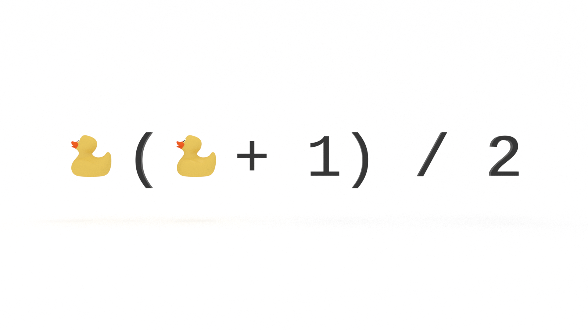

You don’t need to be a math whiz to be a good programmer, but there are a handful of tricks you will want to add to your problem solving bag to improve the performance of your algorithms and make an impression in technical interviews. In this tutorial, you will learn how to sum a series of consecutive integers from 1 to n with a simple and easy to remember equation.

---


This article is an excerpt from [The Little Book of Big O](https://gum.co/big-o).

---


How would _you_ add these numbers?

```
[1,2,3,4,5,6,7,8,9,10]
```

Was your first thought to take the ‘brute force’ approach? 

```
1 + 2 = 3
3 + 3 = 6
6 + 4 = 10
10 + 5 = 15
15 + 6 = 21
21 + 7 = 28
28 + 8 = 36 
36 + 9 = 45
45 + 10 = 55
```

Nothing wrong with that and you probably didn’t need pen and paper or a calculator to get there.

What if the array contained 100 or 1,000 or 1,000,000 elements? 

Brute force would be brutal. 


## Programming is Problem Solving

What is programming? 

Programming is problem solving. 

What problems do we solve?

There are two primary categories of problems we solve as programmers:

* Automation

* Algorithms

We could easily write a for loop to automate the addition of our series:

```js
const nums = [1,2,3,4,5,6,7,8,9,10];
 
const sumHarder = arr => {
   let sum = 0;
   for (let i = 0; i < arr.length; i++) {
       sum += arr[i];
   }
   return sum;
}
 
const result = sumHarder(nums);
```

That solves the problem of needing to manually sum the numbers.

Will it scale? 

What’s the Big O? 

O(n).

Why? 

Our function needs to perform one operation for every input, so the order of our algorithm is O(n) or linear time complexity.

**There must be a better way!**


## How to Sum Integers 1 to n

Rather than automate the brute force approach, how can we solve this problem _algorithmically_? 

Take another look at our array. Is there a different approach we could take to find the sum?

```
[1,2,3,4,5,6,7,8,9,10]
```

When you added the series, you most likely started at one end and worked towards the other. 

Or maybe you started at the end and worked backwards, like so: 
```
10 + 9 = 19
19 + 8 = 27
27 + 7 = 34
34 + 6 = 40
40 + 5 = 45
45 + 4 = 49
49 + 3 = 52
53 + 2 = 54
54 + 1 = 55
```

What if we put our forward and back approaches side-by-side?

| Sum Up 🌄        | Sum Down 🌆        |
| ---            | ---            |
| 1 + 2 = 3        | 10 + 9 = 19        |
| 3 + 3 = 6        | 19 + 8 = 27        |
| 6 + 4 = 10        | 27 + 7 = 34        |
| 10 + 5 = 15        | 34 + 6 = 40        |
| 15 + 6 = 21        | 40 + 5 = 45        |
| 21 + 7 = 28        | 45 + 4 = 49        |
| 28 + 8 = 36         | 49 + 3 = 52        |
| 36 + 9 = 45        | 53 + 2 = 54        |
| 45 + 10 = 55        | 54 + 1 = 55        |

Notice anything? 

If we sum the sums in each row of our table, we get multiples of 11. 

| Sum Up 🌄        | Sum Down 🌆        | Sum All Around 🌞   |
| ---            | ---            | ---             |
| 1 + 2 = 3        | 10 + 9 = 19        | 3 + 19 = 22        |
| 3 + 3 = 6        | 19 + 8 = 27        | 6 + 27 = 33        |
| 6 + 4 = 10        | 27 + 7 = 34        | 10 + 34 = 44        |
| 10 + 5 = 15        | 34 + 6 = 40        | 15 + 40 = 55        |
| 15 + 6 = 21        | 40 + 5 = 45        | 21 + 45 = 66        |
| 21 + 7 = 28        | 45 + 4 = 49        | 28 + 49 = 77        |        
| 28 + 8 = 36         | 49 + 3 = 52        | 36 + 52 = 88        |
| 36 + 9 = 45        | 53 + 2 = 54        | 45 + 54 = 99        |
| 45 + 10 = 55        | 54 + 1 = 55        | 55 + 55 = 110    |

Interesting… 🤔

What if we started at both ends, and worked our way to the middle? 

```
1 + 10 = 11
2 + 9 = 11
3 + 8 = 11
4 + 7 = 11
5 + 6 = 11
```

See a pattern?

We have five pairs each summing to 11. The product of those pairs is, you guessed it, 55.

🤯

How do you make this calculation if you don’t know the length of your array?

We will still make our pairs, but we’ll use a variable, _n_, as a placeholder for the length of our array.

```
1 + n    = (n + 1)
2 + n -1 = (n + 1)
```

Wait! What? Why `n - 1`? 

We want to pair the second element in our array with the second to last element. The second element is 2 and the second to last element is the length of our array minus 1, so `n - 1`. What is the sum of `2 + n - 1`?  

```
n + 1
```

I think you see where this is going.
```
3 + n - 2 = n + 1
4 + n - 3 = n + 1
5 + n - 4 = n + 1
```

At some point we will reach the median of our array. That value will be `n / 2`. Here, our median is 5, which is the quotient of 10 divided by 2.

What is `n / 2` multiplied by `n + 1`? 
```
n ( n + 1) / 2
```

When we manually mapped out our pairs earlier, how did we perform our calculation? We multiplied 11, the sum of our high and low values, by 5, which is 10 divided by 2. Let’s plug `10` into our equation.
```
10 ( 10 + 1) / 2 = 55
```

Following the order of operations:
```
10 + 1 = 11
11 * 10 = 110
110 / 2 = 55
```

Mathemagical! ✨

But! 

A quick eye will notice that this works well if our array is even in length. What if it’s not? What if our array contains an odd number of elements? 
```
[1,2,3,4,5,6,7,8,9]
```

If we map out our high / low value pairs, we find ourselves with a lonely median: 
```
1 + 9 = 10
2 + 8 = 10
3 + 7 = 10
4 + 6 = 10
5
```

Notice that the values all sum to an even number, unlike with our even length array, in which the low/high pairs summed to an odd number.

So what is 5? It’s half the sum of our pairs. In other words, our median is half the sum of `n + 1`. 

We can write this as an equation to identify the median:
```
(n + 1) / 2
```

Look familiar? What’s missing? 

If we know the median, what do we need to do next? 

We simply need to multiply this value by the length of our array.
```
n (n + 1) / 2
```

Regardless of the array length, this equation is incredibly useful in helping us make our algorithms more efficient. 

Let’s take another look at our function above. How can we refactor this to improve its Big O? 


```js
const nums = [1,2,3,4,5,6,7,8,9,10];
 
const sumHarder = arr => {
   let sum = 0;
   for (let i = 0; i < arr.length; i++) {
       sum += arr[i];
   }
   return sum;
}
```

We simply translate our equation into JavaScript!
```js
const sumSmarter = arr => arr.length * (arr.length + 1) / 2;
```

What's the order of our new function? 

O(1).

Regardless of the length of the array, our function will always perform the same number of operations.


## How to Sum Integers 1 to n

You don’t need to be a math whiz to be a good programmer, but there are a handful of equations you will want to add to your problem solving toolbox. In this tutorial, you learned how to sum a series of consecutive integers with a simple and easy to remember equation. It’s like a party trick for technical interviews. 


