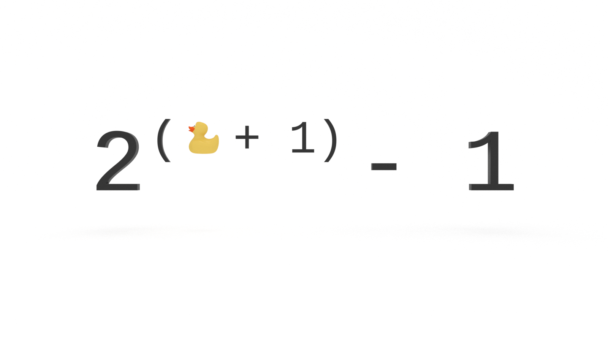

You don’t need to be a math whiz to be a good programmer, but there are a handful of tricks you will want to add to your problem solving bag to improve the performance of your algorithms and make an impression in technical interviews. In this tutorial, you will learn how to sum consecutive powers of 2 with a simple and easy to remember equation.

---
Want to level up your problem solving skills? I write a weekly newsletter about programming, problem solving and lifelong learning.

[Sign up for The Solution](http://eepurl.com/cP8CMn)

---


## How to Sum Consecutive Powers of 2

How would you add these numbers? 
```
2^0 + 2^1 + 2^2 + 2^3 
```

Was your first thought to take the ‘brute force’ approach? 
```
2^0 = 1
2^1 = 2, + 1 = 3
2^2 = 4, + 3 = 7
2^3 = 8, + 7 = 15
```

Nothing wrong with that and you probably didn’t need a pen and paper or a calculator to get there.

What if the final power was not 2^3 but 2^30? Or 2^300?

Brute force would be brutal.

What if you were presented with this situation?
```
2^0 + 2^1 + 2^2 + … + 2^n = ?
```

How would you solve this?


## Programming is Problem Solving

What is programming?

Programming is problem solving.

What problems do we solve?

There are two primary categories of problems we solve as programmers:
* Automation
* Algorithms

We could write a for loop to automate the addition of our powers of 2:
```js
const sumPowers2 = power => {
 let sum = 0;
 
 for (let i = 0; i < power; i++) {
   sum += 2**i;
 }
 return sum;
}

```

Will it scale? 

What’s the Big O?

O(n).

Why?

Our function needs to perform one operation for every input, so the order of our algorithm is [O(n) or linear time complexity](https://jarednielsen.com/big-o-linear-time-complexity/).

**There must be a better way!**

Rather than automate the brute force approach, how can we solve this problem _algorithmically_?


## Math O’Clock 🧮 🕐

I’m about to blow your mind.

Check this out:

```
1 = 1
```

😐

Bear with me.

🐻

If `1` is equal to `1`, then it follows that

```
1 = 2 - 1
```

And if 
```
1 + 2 = 3
```

Then it follows that
```
1 + 2 = 4 - 1
```

Let’s take it one more step. If
```
1 + 2 + 4 = 7
```

Then
```
1 + 2 + 4 = 8 - 1
```

Cool?

😎

Let’s power up!

What is `x` in this equation? 
```
2^x = 8
```

Or, in plain English, “How many 2s multiplied together does it take to get 8?”

We could also write it as a logarithm:
```
log2(8) = 3
```

We could say, “To what power do we raise 2 for a product of 8?”

🧐

We know that `2^2 = 4`.

And `2^1 = 2`

And `2^0 = 1`.

“Wait, what?”

Why is `2^0 = 1`? 

Table time! 🏓

| Exponent    | =        | =    | Power    |
| ---        | ---        | ---    | ---        |
| 2^3        |        |    | 8        |
| 2^2        | (2^3) / 2    | 8 / 2    | 4        |
| 2^1        | (2^2) / 2    | 4 / 2    | 2        |
| 2^0        | (2^1) / 2    | 2 / 2    | 1        |

See the pattern? 

What is `2^4`? 
```
16
```

What is the sum of the powers of `2^4`? 

```
1 + 2 + 4 + 8 + 16 = 31
```

What’s another way we can describe `31`?

```
31 = 32 - 1
```

What is `2^5`?

```
32
```

Did you see what happened there? 

The sum of the powers of two is one less than the product of the next power. 

🤯

Let’s make another table! 🏓🏓

| Exponent    | Power    | Sum of Powers    |
| ---        | ---        | ---            |
| 2^0        | 1        | n/a            |
| 2^1        | 2        | 3            |
| 2^2        | 4        | 7            |
| 2^3        | 8        | 15            |
| 2^4        | 16        | 31            |
| 2^5        | 32        | 63            |

What’s the next exponent? 
```
2^6
```

What’s `2^6`?
```
64
```

So what is the sum of the powers of `2^6`?

🤔

Let’s convert this pattern to an equation to find out.

What if our exponent is unknown, or `n`? 
```
2^n
```

What is the sum of `2^n`?

☝️ The sum of the powers of two is one less than the product of the next power. 

If our power is `n`, what’s the next power?
```
n + 1
```

If `n` is equal to `1`, then it follows
```
2^n = 2
2^(n + 1) = 4
```

And if `n` is equal to `2`, then it follows
```
2^n = 4
2^(n + 1) = 8
```

Lookin’ good!

How do we get _one less_ than the product of the next power?

We simply subtract `1`:
```
2^(n + 1) - 1
```

🎉 There's our equation! 


## Proof by Induction

If `n` is equal to `1`, then it follows
```
2^(n + 1) - 1 = 3
```

If `n` is equal to `2`, then it follows
```
2^(n + 1) - 1 = 7
```

The question above was: 

> What is the sum of the powers of `2^6`?

Let’s prove that our equation, `2^(n + 1) - 1`, works. 

We know that the power of `2^6` is `64`. 
```
2 * 2 * 2 * 2 * 2  * 2
```

We know that the power of `2^7` is `128`. 

If we plug `6` into our equation, the result is 127:
```
2^(6 + 1) - 1 = 127
```

If we manually add the powers of `2^6`, the result is also 127:
```
1 + 2 + 4 + 8 + 16 + 32 + 64 = 127
```

💥 Proof! 

The sum of the powers of two is one less than the product of the next power. 

Don't take my word for it. Try it with a larger value.


## Programming is Problem Solving

Let’s take another look at our function from above. How can we refactor this to improve its time complexity?
```js
const sumPowers2 = power => {
 let sum = 0;
 
 for (let i = 0; i < power; i++) {
   sum += 2**i;
 }
 return sum;
}
```

We simply translate our equation into JavaScript!
```js
const sumPowers2 = power => 2**(power + 1) - 1;

```

What’s the order of our new function?

O(1).

Regardless of the size of the input, our function will always perform the same number of operations.


## How to Sum Consecutive Powers of 2

You don’t need to be a math whiz to be a good programmer, but there are a handful of equations you will want to add to your problem solving toolbox. In this tutorial, you learned how to sum consecutive powers of 2 with a simple and easy to remember equation. It’s like a party trick for technical interviews.


