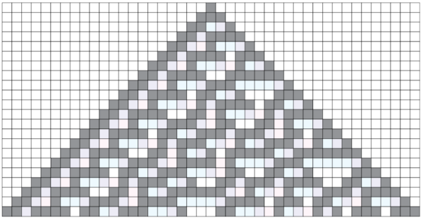
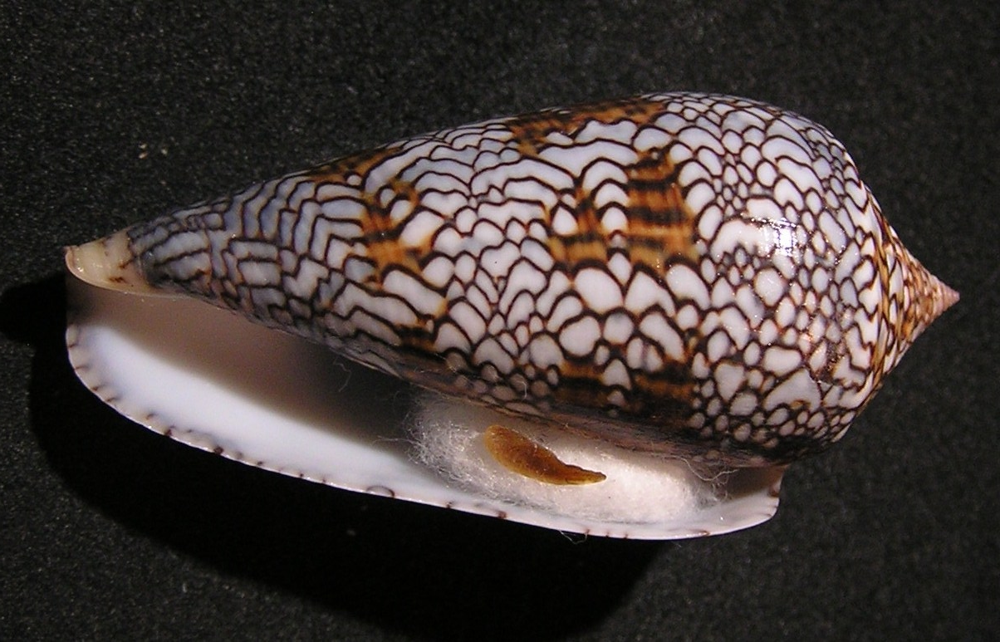
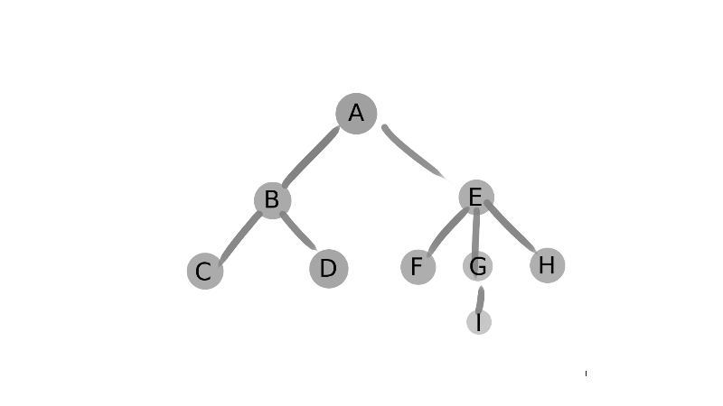
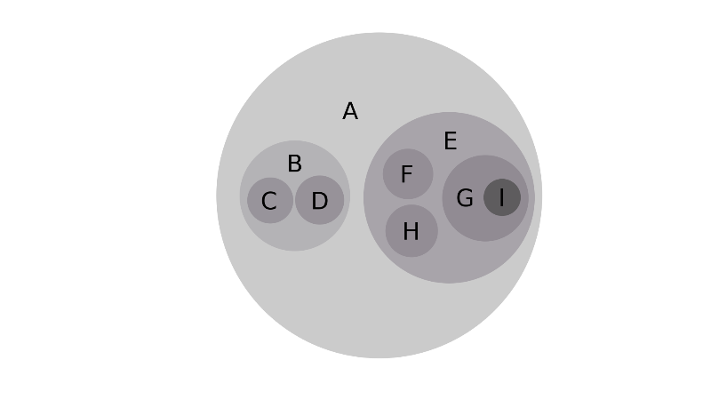

Are you seeing the forest for the trees?

What does that even mean?

Missing the forest for the trees means we become too involved in the details of a problem to see the situation as a whole. 

This is the Achilles heel of being a programmer. We’re trained to develop laser focus. Like Cyclops, we can use that laser focus to cut through any problem. Unfortunately, that laser focus often impedes our ability to see the big picture. Like The Law of the Instrument states, when you’re a hammer, all you see is nails. If we are so focused on solving small problems, we will neglect the bigger, societal issues, such as systemic racism and climate change that our work may unwittingly reinforce.

We need that laser focus to Get Things Done. ⚡

But we also need something else. 

Rainbow focus? 

🌈
 
## The STEAM Rainbow

During the Great Recession there was an increased emphasis on the fields of science, technology, engineering, and mathematics, or STEM, as it is commonly known. There were a lot of political motivations behind this but the economic drive was to fill employment gaps. There was more demand for STEM professionals than there were qualified candidates. Another issue was the lack of diversity in STEM professions. The many efforts to solve these problems is known as the STEM pipeline.

As a STEM professional, I recognize the importance of the STEM pipeline, but as a graduate of arts programs, I see an important component missing. So did Georgette Yakman, who founded the STEAM initiative which is “a way to teach how all things relate to each other, in school and in life.”

But STEAM pipeline doesn’t have the same ring, though, so I propose the STEAM rainbow. 

John Maeda makes the case for STEAM in _How to Speak Machine_:

> ...the arts are not about what you can just see or sense; they’re about discovering what underlies it all--about understanding what lies at the essential core of anything and everything.

Maeda illustrates STEAM with Stephen Wolfram’s Rule 30, a cellular automaton. Wolfram’s classification scheme generates rows of cells according to eight criteria, where the criteria for cell creation differs from rule to rule. Using binary, Rule 30 states the following:

* If the three cells above the new cell are 000, the new cell is also 0.

* If the three cells above the new cell are 111, the new cell is 0. 

* If the three cells above the new cell are 110, the new cell is 0.

* If the three cells above the new cell are 101, the new cell is 0.

* If the three cells above the new cell are 100, the new cell is 1.

* If the three cells above the new cell are 011, the new cell is 1.

* If the three cells above the new cell are 010, the new cell is 1.

* If the three cells above the new cell are 001, the new cell is 1.

These criteria can also be visualized:


Running this program generates the following:




If we zoom out, it looks like this:


And?

Wait for it...



 
[Pattern forming](https://jarednielsen.com/pattern-forming/) and [pattern recognition](https://jarednielsen.com/patterrn-recognition/)! 🤯

This is the Conus textile snail. Wolfram's Rule 30 resembles the pattern on its shell. Or does the shell resemble the rule?

🤔

 
## How to Observe

How do the arts prepare you for programming? 

In _Sparks of Genius_, Robert and Michele Root-Bernstein state that: 

> ...professors at MIT and California Institute of Technology as well as research directors at major engineering firms have long realized that what eventually separates successful scientists and engineers from the rest of the students in their classes is the ability to feel or see what the equations mean.

How do you learn to feel or see an equation? 

The Root-Bernstein’s outline 13 thinking tools of the world’s most creative people. Among them are pattern recognition and pattern forming, as we saw above. But the first, and foremost, is _observing_. 

What is observing? 

It’s looking. But not just looking. It’s looking and looking again. And it isn’t limited to the visual realm. It’s also listening and feeling, but doing so with intention.

The Root-Bernstein’s recognize that the visual realm is the easiest place to begin and outline a simple process to learn how to observe:

1. Select an object, notice its form, its lines, its colors, its sounds, its tactile characteristics, its smell, perhaps even its taste.
    
2. Then remove the object and recall one by one as many details as possible.
    
3. Write about what you perceived or draw it.
    
4. Go back and observe it again.

We don’t need to be good at this. We just need to do it. The goal is to keep our minds sharp.

According to painter Jasper Johns:

> Part of the activity of art is one of exercise, and an activity that keeps faculties lively, whatever the discipline touches on: the mind, the ear, whatever. And one hopes that by sharpening such things and by an attempt to see the possibilities that are offered… that the senses we use in dealing with our lives will be in a state of readiness to deal with whatever may happen.


There are numerous studies that show a direct correlation between the ability to think visually and success as an engineer. Nikola Tesla describes imaging in his memoir:

> When I get an idea I start at once building it up in my imagination. I change the construction, make improvements and operate the device in my mind. It is absolutely immaterial to me whether I run my turbine in my thought or test it in my shop. I even note if it is out of balance.

What type of visual thinker are you? 

Imagine a triangle.

How did you see it? 

Some people need to draw it on paper or trace the outline with their fingers. Some people need to close their eyes to see it. And some people can see the image with their eyes open, like an augmented reality overlay.

A triangle is easy. Try these additional problems:

* What object has a round profile from the top and from the sides? 

* What object has a square profile from the top and from the sides?

* What object has a triangular profile from all sides? 

Too easy? Try these:

* What object has a round profile from the top and square profiles from the sides?
    
* What object has a square profile from the top and triangular profiles from the sides?
    
* What object has a round profile from the top and triangular profiles from the sides?

(Answers below.)
 
What problem(s) does visual thinking solve?

So maybe you’re thinking, “This is for engineers. I’m a programmer. Engineers work with concrete things (pun intended), I work with pure thought stuff. I build castles in the cloud.”

The authors of _Sparks of Genius_ would reply: 

> Not everyone may have the extraordinary potential of a Tesla, but everyone benefits from the development of imaging techniques that comes with hands-on experience in arts or crafts, or with simple mental practice.
_
I splurged and picked up the box set of Donald Knuth's _The Art of Computer Programming_. It’s a fascinating and frustrating read. One of the more fascinating things is how Knuth visualized tree data structures.

This is a tree:



This is also a tree:
```
A(B(C( ), D( )), E(F( ), G(I( )), H( )))
```

And this is also a tree: 

* A
    * B
        * C
        * D

* E
    * F
    * G
        * I
    * H


And what’s this? 




You guessed it: a tree! 🤯

## How to be a visual thinker

Anyone can think visually. But how do we do it? More importantly, how do we improve our ability to do it? According to the authors of _Sparks of Genius_, there are four steps we can follow: 

* Recognize your own use of visual, aural, and other images. 
 
* Indulge yourself! Image on purpose and to your heart’s content.
    
* Take up an art. Learn to make drawings, songs, poems, or gourmet dishes. 
    
* Make up excuses to use your inner eye, your inner ear, your inner nose, your inner sense of touch and of body. 

There you go! Permission to play!


## The Superlative Guide to Visual Thinking

If we want to improve our problem solving skills, we will want to improve our ability to think visually. Visual thinking allows you to see the solution, or multiple solutions, to a problem before setting out to solve it. But forming images is not limited to visual means. We can also image aurally, tactilely, and olfactorily. 


